Digitizing
============

In this lab, you will digitize four map layers centered on Oakland Schools Technical School Campus Northwest (or any other location you choose).  You will digitize at least four vector layers, e.g., building footprints, streets, lakes, vegetation, etc,  Instead of scanning and georeferencing an image to use as background for digitizing, we will use satellite imagery from QGIS as our background.  The output of this exercise is a professionally looking map of the features you digitized.  Follow the instructions below to complete the lab.

|

Previewing the Basemap
----------------------------------

1. Create a folder in your hard drive and give it a suitable name, e.g., c:\Digitizing.

2. Start QGIS, create a new project, and save it to the digitizing folder. 

3.  Click on XYZ tiles under Browser to the left of the screen and select Bing Maps. Pan and zoom to Michigan.

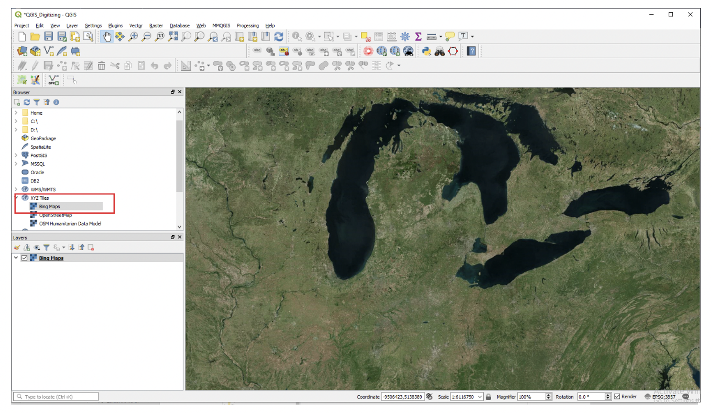

4. If the tiles are missing, then copy the entire script below ::

     # Sources
     sources = []
     sources.append(["connections-xyz","Google Maps","","","","https://mt1.google.com/vt/lyrs=m&x=%7Bx%7D&y=%7By%7D&z=%7Bz%7D","","19","0"])
     sources.append(["connections-xyz","Google Satellite", "", "", "", "https://mt1.google.com/vt/lyrs=s&x=%7Bx%7D&y=%7By%7D&z=%7Bz%7D", "", "19", "0"])
     sources.append(["connections-xyz","Google Terrain", "", "", "", "https://mt1.google.com/vt/lyrs=t&x=%7Bx%7D&y=%7By%7D&z=%7Bz%7D", "", "19", "0"])
     sources.append(["connections-xyz","Google Terrain Hybrid", "", "", "", "https://mt1.google.com/vt/lyrs=p&x=%7Bx%7D&y=%7By%7D&z=%7Bz%7D", "", "19", "0"])
     sources.append(["connections-xyz","Google Satellite Hybrid", "", "", "", "https://mt1.google.com/vt/lyrs=y&x=%7Bx%7D&y=%7By%7D&z=%7Bz%7D", "", "19", "0"])
     sources.append(["connections-xyz","Stamen Terrain", "", "", "Map tiles by Stamen Design, under CC BY 3.0. Data by OpenStreetMap, under ODbL", "http://tile.stamen.com/terrain/%7Bz%7D/%7Bx%7D/%7By%7D.png", "", "20", "0"])
     sources.append(["connections-xyz","Stamen Toner", "", "", "Map tiles by Stamen Design, under CC BY 3.0. Data by OpenStreetMap, under ODbL", "http://tile.stamen.com/toner/%7Bz%7D/%7Bx%7D/%7By%7D.png", "", "20", "0"])
     sources.append(["connections-xyz","Stamen Toner Light", "", "", "Map tiles by Stamen Design, under CC BY 3.0. Data by OpenStreetMap, under ODbL", "http://tile.stamen.com/toner-lite/%7Bz%7D/%7Bx%7D/%7By%7D.png", "", "20", "0"])
     sources.append(["connections-xyz","Stamen Watercolor", "", "", "Map tiles by Stamen Design, under CC BY 3.0. Data by OpenStreetMap, under ODbL", "http://tile.stamen.com/watercolor/%7Bz%7D/%7Bx%7D/%7By%7D.jpg", "", "18", "0"])
     sources.append(["connections-xyz","Wikimedia Map", "", "", "OpenStreetMap contributors, under ODbL", "https://maps.wikimedia.org/osm-intl/%7Bz%7D/%7Bx%7D/%7By%7D.png", "", "20", "1"])
     sources.append(["connections-xyz","Wikimedia Hike Bike Map", "", "", "OpenStreetMap contributors, under ODbL", "http://tiles.wmflabs.org/hikebike/%7Bz%7D/%7Bx%7D/%7By%7D.png", "", "17", "1"])
     sources.append(["connections-xyz","Esri Boundaries Places", "", "", "", "https://server.arcgisonline.com/ArcGIS/rest/services/Reference/World_Boundaries_and_Places/MapServer/tile/%7Bz%7D/%7By%7D/%7Bx%7D", "", "20", "0"])
     sources.append(["connections-xyz","Esri Gray (dark)", "", "", "", "http://services.arcgisonline.com/ArcGIS/rest/services/Canvas/World_Dark_Gray_Base/MapServer/tile/%7Bz%7D/%7By%7D/%7Bx%7D", "", "16", "0"])
     sources.append(["connections-xyz","Esri Gray (light)", "", "", "", "http://services.arcgisonline.com/ArcGIS/rest/services/Canvas/World_Light_Gray_Base/MapServer/tile/%7Bz%7D/%7By%7D/%7Bx%7D", "", "16", "0"])
     sources.append(["connections-xyz","Esri National Geographic", "", "", "", "http://services.arcgisonline.com/ArcGIS/rest/services/NatGeo_World_Map/MapServer/tile/%7Bz%7D/%7By%7D/%7Bx%7D", "", "12", "0"])
     sources.append(["connections-xyz","Esri Ocean", "", "", "", "https://services.arcgisonline.com/ArcGIS/rest/services/Ocean/World_Ocean_Base/MapServer/tile/%7Bz%7D/%7By%7D/%7Bx%7D", "", "10", "0"])
     sources.append(["connections-xyz","Esri Satellite", "", "", "", "https://server.arcgisonline.com/ArcGIS/rest/services/World_Imagery/MapServer/tile/%7Bz%7D/%7By%7D/%7Bx%7D", "", "17", "0"])
     sources.append(["connections-xyz","Esri Standard", "", "", "", "https://server.arcgisonline.com/ArcGIS/rest/services/World_Street_Map/MapServer/tile/%7Bz%7D/%7By%7D/%7Bx%7D", "", "17", "0"])
     sources.append(["connections-xyz","Esri Terrain", "", "", "", "https://server.arcgisonline.com/ArcGIS/rest/services/World_Terrain_Base/MapServer/tile/%7Bz%7D/%7By%7D/%7Bx%7D", "", "13", "0"])
     sources.append(["connections-xyz","Esri Transportation", "", "", "", "https://server.arcgisonline.com/ArcGIS/rest/services/Reference/World_Transportation/MapServer/tile/%7Bz%7D/%7By%7D/%7Bx%7D", "", "20", "0"])
     sources.append(["connections-xyz","Esri Topo World", "", "", "", "http://services.arcgisonline.com/ArcGIS/rest/services/World_Topo_Map/MapServer/tile/%7Bz%7D/%7By%7D/%7Bx%7D", "", "20", "0"])
     sources.append(["connections-xyz","OpenStreetMap Standard", "", "", "OpenStreetMap contributors, CC-BY-SA", "http://tile.openstreetmap.org/%7Bz%7D/%7Bx%7D/%7By%7D.png", "", "19", "0"])
     sources.append(["connections-xyz","OpenStreetMap H.O.T.", "", "", "OpenStreetMap contributors, CC-BY-SA", "http://tile.openstreetmap.fr/hot/%7Bz%7D/%7Bx%7D/%7By%7D.png", "", "19", "0"])
     sources.append(["connections-xyz","OpenStreetMap Monochrome", "", "", "OpenStreetMap contributors, CC-BY-SA", "http://tiles.wmflabs.org/bw-mapnik/%7Bz%7D/%7Bx%7D/%7By%7D.png", "", "19", "0"])
     sources.append(["connections-xyz","OpenTopoMap", "", "", "Kartendaten: © OpenStreetMap-Mitwirkende, SRTM | Kartendarstellung: © OpenTopoMap (CC-BY-SA)", "https://tile.opentopomap.org/%7Bz%7D/%7Bx%7D/%7By%7D.png", "", "17", "1"])
     sources.append(["connections-xyz","Strava All", "", "", "OpenStreetMap contributors, CC-BY-SA", "https://heatmap-external-b.strava.com/tiles/all/bluered/%7Bz%7D/%7Bx%7D/%7By%7D.png", "", "15", "0"])
     sources.append(["connections-xyz","Strava Run", "", "", "OpenStreetMap contributors, CC-BY-SA", "https://heatmap-external-b.strava.com/tiles/run/bluered/%7Bz%7D/%7Bx%7D/%7By%7D.png?v=19", "", "15", "0"])
     sources.append(["connections-xyz","Open Weather Map Temperature", "", "", "Map tiles by OpenWeatherMap, under CC BY-SA 4.0", "http://tile.openweathermap.org/map/temp_new/%7Bz%7D/%7Bx%7D/%7By%7D.png?APPID=1c3e4ef8e25596946ee1f3846b53218a", "", "19", "0"])
     sources.append(["connections-xyz","Open Weather Map Clouds", "", "", "Map tiles by OpenWeatherMap, under CC BY-SA 4.0", "http://tile.openweathermap.org/map/clouds_new/%7Bz%7D/%7Bx%7D/%7By%7D.png?APPID=ef3c5137f6c31db50c4c6f1ce4e7e9dd", "", "19", "0"])
     sources.append(["connections-xyz","Open Weather Map Wind Speed", "", "", "Map tiles by OpenWeatherMap, under CC BY-SA 4.0", "http://tile.openweathermap.org/map/wind_new/%7Bz%7D/%7Bx%7D/%7By%7D.png?APPID=f9d0069aa69438d52276ae25c1ee9893", "", "19", "0"])
     sources.append(["connections-xyz","CartoDb Dark Matter", "", "", "Map tiles by CartoDB, under CC BY 3.0. Data by OpenStreetMap, under ODbL.", "http://basemaps.cartocdn.com/dark_all/%7Bz%7D/%7Bx%7D/%7By%7D.png", "", "20", "0"])
     sources.append(["connections-xyz","CartoDb Positron", "", "", "Map tiles by CartoDB, under CC BY 3.0. Data by OpenStreetMap, under ODbL.", "http://basemaps.cartocdn.com/light_all/%7Bz%7D/%7Bx%7D/%7By%7D.png", "", "20", "0"])
     sources.append(["connections-xyz","Bing VirtualEarth", "", "", "", "http://ecn.t3.tiles.virtualearth.net/tiles/a{q}.jpeg?g=1", "", "19", "1"])

     # Add sources to browser

     for source in sources:
        connectionType = source[0]
        connectionName = source[1]
        QSettings().setValue("qgis/%s/%s/authcfg" % (connectionType, connectionName), source[2])
        QSettings().setValue("qgis/%s/%s/password" % (connectionType, connectionName), source[3])
        QSettings().setValue("qgis/%s/%s/referer" % (connectionType, connectionName), source[4])
        QSettings().setValue("qgis/%s/%s/url" % (connectionType, connectionName), source[5])
        QSettings().setValue("qgis/%s/%s/username" % (connectionType, connectionName), source[6])
        QSettings().setValue("qgis/%s/%s/zmax" % (connectionType, connectionName), source[7])
        QSettings().setValue("qgis/%s/%s/zmin" % (connectionType, connectionName), source[8])

     # Update GUI
     iface.reloadConnections()

5. Script Source: The script above was taken from:
https://github.com/klakar/QGIS_resources/blob/master/collections/Geosupportsystem/python/qgis_basemaps.py   

6. In QGIS, click on Plugins | Python Console and paste the script into the console. Press enter. The tiles controls will be added to the QGIS.

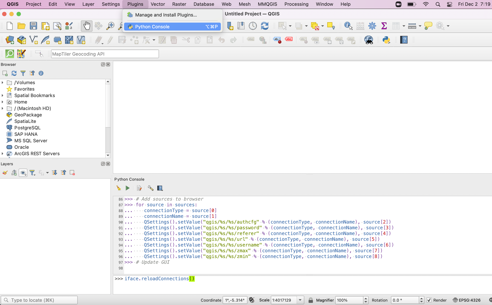

7. The basemaps are visible under the XYZ Tiles dropdown.

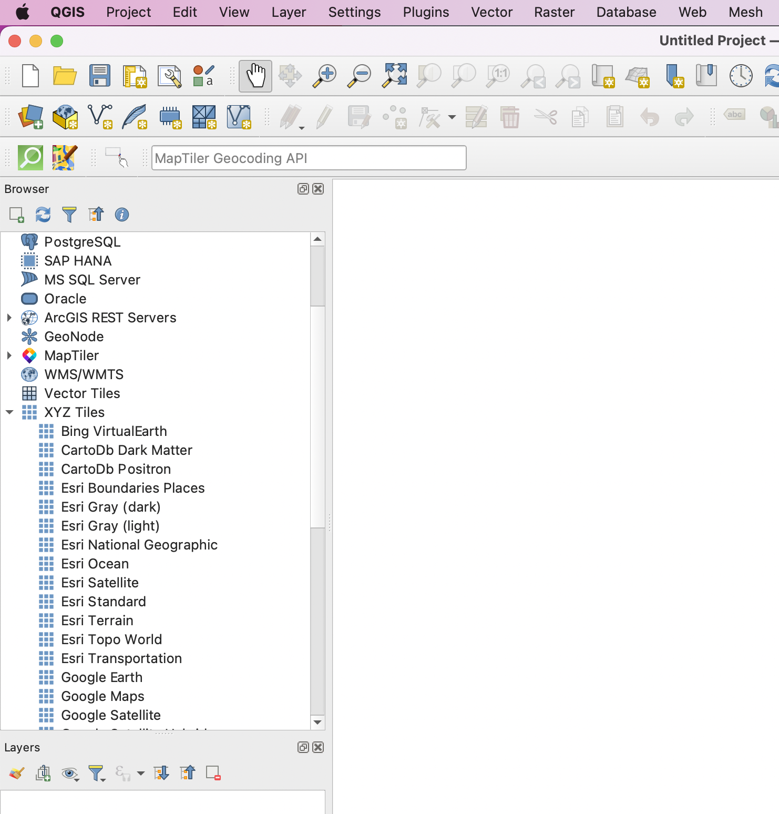

8. Our area of interest is located at -83.452499; Lat: 42.736869. To zoom to this location, we will use a plugin named Lat\Long Tools.  Click on Plugins | Manage and Install Plugins.

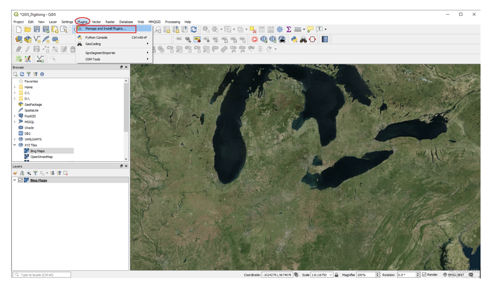

9. Scroll down to Lat\Long Tools. Select the plugin and click on Install plugin to the bottom right of the page.

10. When the plugin is done installing, a toolbar will appear among the set of toolbars in QGIS.   Click on the red marker and the Lat \ Long plugin will place a dialog at the bottom of the screen for you to enter a pair of lat\long.  Enter the values “42.736869, -83.452499: and press enter. The location of the X,Y value will appear as a red cross. 

.. image:: img/digitizing4.png
   :alt: QGIS Add Plug in

11. Zoom in to the red cross until you see the college campus clearly.

.. image:: img/digitizing5.png
   :alt: QGIS Find Lat_Long with Lat Long Tool

12. Whenever you locate a place to use as a background for digitizing, it is a good idea to create a *bookmark* to help you to return to that location quickly if you panned away from it.  To create a bookmark for the College, click on View | New Bookmark. Give the bookmark a name.  If you go elsewhere on the map and want to return to that location, just click on the bookmark and it will take you back to that location. 

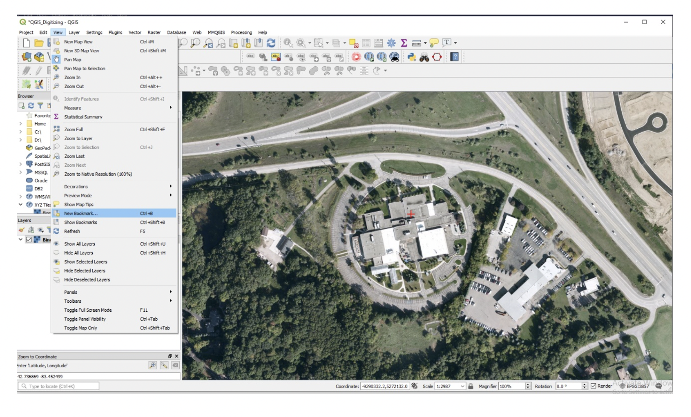

|

Determining the Coordinate System of the Basemap
--------------------------------------------------

1.	Information on the Coordinate System of the basemap can be quickly determined.  To do so, right click on Bing Map, select Properties.  Take a moment and read the information that is in the dialog.    

.. image:: img/digitizing7.png
   :alt: QGIS Basemap Properties

2. Now, click on Source.  The coordinate system is given as EPSG 3857 – WGS 84 Pseudo Mercator.  All shapefiles digitized from this basemap will automatically take on this coordinate system. 

.. image:: img/digitizing8.png
   :alt: QGIS Read Coordinates

|
 

Create New, Empty Shapefiles
-----------------------------

1. For this project, we will create the following layers: 

   * outline of study area
   * building footprints
   * roads
   * lakes
   * vegetation

2. In QGIS, click on Layer | Create Layer | New Shapefile Layer.

.. image:: img/digitizing9.png
   :alt: QGIS Create New Shapefile

3. In the “New Shapefile Layer” box enter the path and name of the new shapefile you want to create, i.e., Study Area. We will digitize “Study Area” as a polygon, so set the Geometry type as polygon. Leave everything else as default and click Ok. 

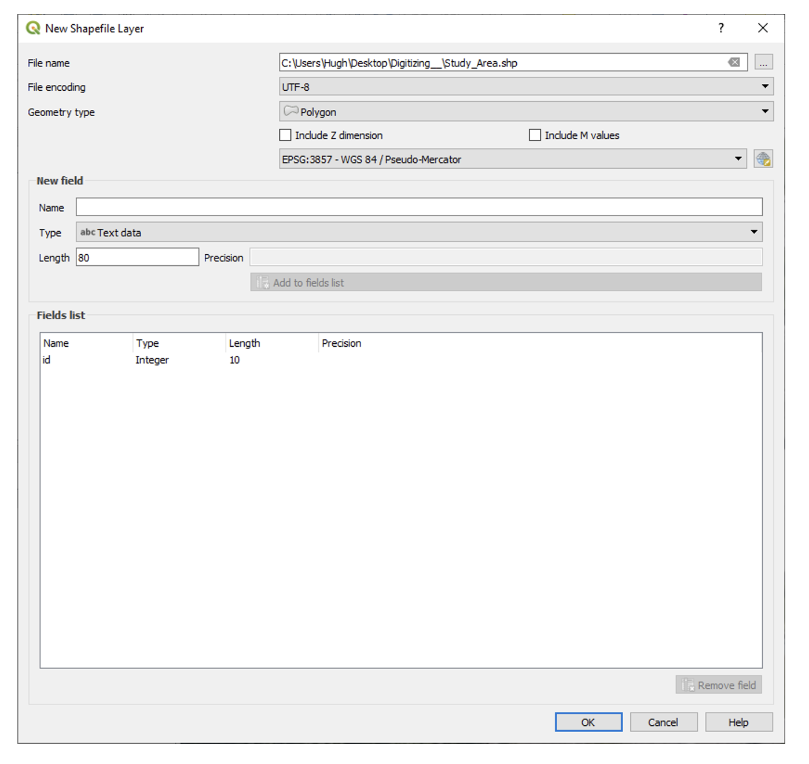

4. Click Ok.  A new empty shapefile will be created called “Study_Area”.

.. image:: img/digitizing11.png
   :alt: QGIS Create New Shapefile

5. Now, repeat the process creating additional empty shapefiles simply by clicking on Layer | Create Layer | New Shapefile Layer.  Create the shapefiles below making sure that you set the geometry type appropriately. If the geometry type is set incorrectly, you will not be able to properly digitize features.
      
      * Building 		 - polygon 
      * Streets 		 - polylines
      * Lakes   		 - polygons 
      * Vegetation       - polygon

6. When you are done, your project should appear similar to what is shown below.

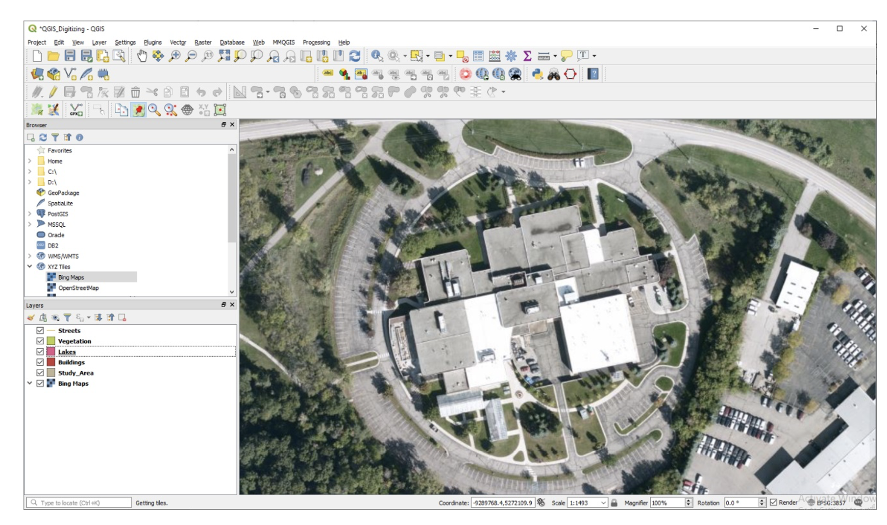

|

Tracing Features  
--------------------

The steps below outline the procedures for conducting heads-up digitizing in QGIS.  

1. In QGIS, ensure that you are zoomed in to the area of interest.

2. In the main toolbar, click on the “Toggle Editing" button.  This puts the software in editing mode so that changes can be made to the shapefiles. 
 
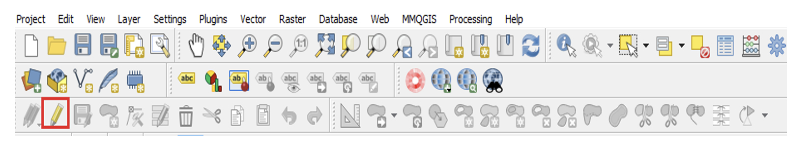

3. Now, select the "Add feature" button   to use for digitizing.
 
.. image:: img/digitizing15.png
   :alt: QGIS Add Feature Button

4. To digitize a polygon that represents the study area, use the left mouse button to click on four or more points to define the study area.  QGIS will automatically create a closed polygon.  Double click to end.
 

.. image:: img/digitizing16.png
   :alt: QGIS Trace Feature

5. The feature attribute dialog will appear. Enter a value, e.g., 1 . This value will appear in the attribute table of the layer.  Click Ok.

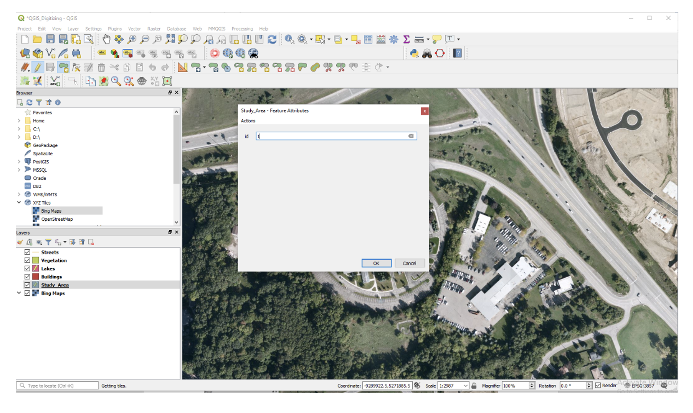
 

6. The layer will be created.  In the main toolbar, click on the “Toggle Editing" button to permanently save the layer.  

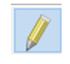

7. The saved layer should appear as shown below.

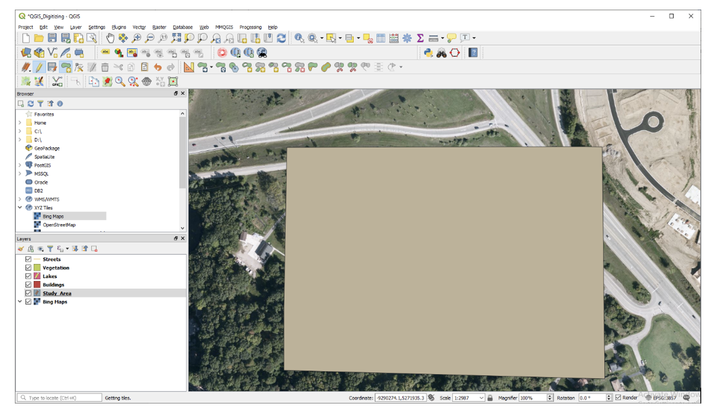

 
8. With the study area layer digitized, click on its icon in the Table of Content, select Symbology, then change its color to transparent. This allows you to see through it while you digitize the other layers. When you digitize the other layers, you do not want to digitize outside the study area’s boundary.
 
.. image:: img/digitizing20.png
   :alt: QGIS Saved Layer

.. image:: img/digitizing21.png
   :alt: QGIS Tranparent Study Area

9. Now, let us digitize the street layer.  

10. Highlight the street layer, then click on the Toggle Editing button.  This time, the “Add Line Feature” tool appears. We use this tool to tract line features.

.. image:: img/digitizing22.png
   :alt: QGIS Add Line Feature

11. The process of digitizing the roads involves clicking along the outline of a road segment at frequent intervals.  When you get to the end of a segment, double click to end. This will result in the dialog below appearing. Enter a value to represent the ID number of the road segment you just created.  Each time, you digitize a road segment, you will be prompted to enter an ID number for the segment.

12. The illustration below shows the results of digitizing the various road segments. 

13. When digitizing you should always zoom in until the feature you are working with fills the screen.  The most common problem is not zooming in enough on the background image. If you do not zoom in enough, you will not see the features clearly.  Zoom in until you can see lines or points clearly.  Also, when digitizing, remember to save your work often. 

14. Now, using the same techniques described above, trace features in the other layers. 

15. The illustration below shows what your completed map could look like. 

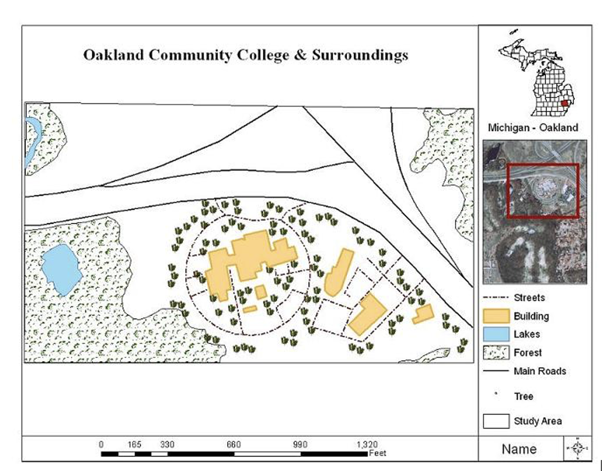

 
|

Entering Attribute Data 
-------------------------

After digitizing a map layer, you could add data to the attribute table of the layer.  In this section, you will add two fields to any of the shapefiles you digitized and then enter attribute data into the records associated with the fields.  You can add real or fictitious data.

1. To begin adding fields to a shapefile’s table, right click on the name of the shapefile you want to add the field, e.g., click on Streets.

2.  Click on Open Attribute Table.  When the new page appears, click on “New Field” to add a new field to the attribute table.  We will add a field to store the names of the roads.

.. image:: img/digitizing26.png
   :alt: QGIS Adding New Field

3. Enter a name for the field. Set the data type to Text and enter 100 as the maximum number of characters that can go into the field. 

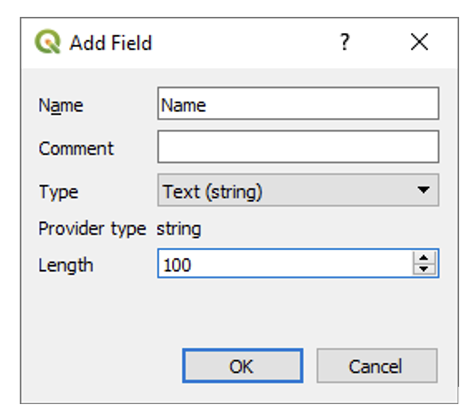

4. When you are done creating the new field, Click Ok to close the dialog. 

5. To enter data into the new field that you created, resize the table dialog so that you can see both the table and the map features. Select a row in the table and the corresponding feature in the map should be highlighted allowing you to see the road feature that is associated with the row. Now, type some value into the row. Press enter when you are done. When you are done entering names, click the Toggle Editing button to save the edits to the table.

 .. image:: img/digitizing28.png
   :alt: QGIS Name of New Column

|

Deliverables
-------------

1. Submit a professional looking vector map of the features you digitized. Do not inclue the raster background in your final map.     

2. Submit a screen shot of the table you created.  

|

Useful Links
------------

https://www.qgistutorials.com/en/docs/digitizing_basics.html