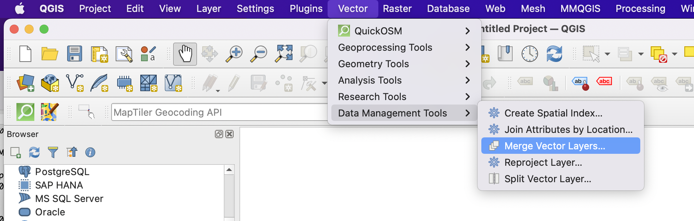

Geoprocessing Spatial Data
=============================

You work for an environmental monitoring company conducting a project in South East Michigan. The project area straddles the boundaries of two adjacent counties, e.g., Wayne and Washtenaw. 

As the GIS expert on the project, you are required to assemble several digital map layers pertaining to the geographic extent of the study area.  Some of the map layers are available as separate files for Wayne and Washtenaw counties, so you will be required to merge and clip these files in order to create seamless layers for the study area.  Other layers are only available for the entire State of Michigan, so you will have to clip these layers to the extent of your study area. 

The shapefiles you are required to assemble are census blocks, soils, geology, roads, drinking wells and streams. You are also required to include a digital elevation model (DEM) of the area. You may include optionally include two orthophotos for extra credit.  
	
Complete the task for your company using data from Michigan’s archived CGI. 

|

Download Data 
---------------

1.	Visit the Michigan CGI’s archived website at https://web.archive.org/web/20160201222536/http://www.mcgi.state.mi.us/mgdl/?action=thm

2. Use the table below as a guide to what you should download.  Since you are downloading the same type of data for both counties, in all you will download six of files. 

.. list-table:: Title
   :widths: 25 25 50
   :header-rows: 1

   * - Layer Name
     - Notes
     - Geoprocessing Action

   * - Census Blocks
     - Block Groups from MI Geographic Framework (v14a)
     - Merge and Clip

   * - STATSGO Soils
     - Available for entire State
     - Clip

   * - Roads
     - MI Geographic Framework Transportation (v14a)
     - Clip

   * - Drinking Water Wells
     - Located under the Geology Section
     - Merge and Clip

   * - Bedrock Geology
     - Located under the GEOLOGY Section.
     - Clip

   * - DEM
     - Located under the TOPOGRAPHY Section
     - Clip

|

3. Create a folder then unzip the files you downloaded to that folder.  Place all of the unzipped files in the same folder.  The illustration below shows some of my zipped and unzipped folders. 

 

 
|

Create a new shapefile to represent your Study Area
----------------------------------------------------

1. You are free to decide on the geographic extent of your study area. The only requirement is that it straddles the boundaries of the two counties.

2.  Open any pair of shapefiles for Wayne and Washtenaw Counties (e.g. the census block layers) and use them as a background for digitizing the boundaries of the study area. The shapefile type is polygon, so leave polygon as the Geometry Type.   

.. image:: img/geoprocessing_studyarea.png
   :alt: Study Area

|

Merge Shapefiles
-------------------

The pairs of shapefiles you downloaded that need merging should be merged before they are clipped.  For example, the census block group files for Wayne and Washtenaw Counties need to be merged before clipping.  In order to merge the shapefiles, you will use geoprocessing tools from Toolbox. 

1. Click on Vector | Data Management tools | Merge Vector Layers

2. Fill out the dialog that appears. Under "Input layers", enter the names of the two files to merge. 

.. image:: img/geoprocessing_mergelayers2.png
   :alt: Downloaded Files

3. Ensure that the path and name of your output are correct, then click Run. The resultant merged shapefile appears as shown below.  

.. image:: img/geoprocessing_mergelayers3.png
   :alt: Downloaded Files

4. Repeat the process for the other pairs of shapefiles you need to merge.

|

Clip All Shapefiles to the Extent of the Study Area
----------------------------------------------------

1.	Ensure that the Study area shapefile is loaded into QGIS.

2. Click on Vector | Geoprocessing Tools | Clip.

.. image:: img/geoprocessing_cliplayer1.png
   :alt: Downloaded Files

2.	Fill out the dialog that appears. Note that the Input Features are the features you want to clip, i.e., the Merged Census Blocks.  The Clip Feature is the file that serves as the cookie cutter, i.e., the study area polygon that you digitized.

3.	If necessary, re-specify a path and a name for the output. Click Ok

 

4. The resultant file should appear as shown in the illustration. 

.. image:: img/geoprocessing_cliplayer3.png
   :alt: Downloaded Files

5. Repeat the process for the other shapefiles you want to clip.

|

Merging and Clipping the Digital Elevation Models (DEMs)
---------------------------------------------------------

DEMs are floating point raster grids containing Z values that represent elevation. The steps
for clipping rasters are different compared to those for clipping shapefiles.  Below, I illustrate how DEMS are mosaiced (merged) and clipped in QGIS.  Click on this link for more information: https://docs.qgis.org/3.4/en/docs/training_manual/processing/cutting_merging.html

**Mosaicing DEMs**

1. Add the DEMs for Wayne and Washtenaw Counties to QGIS. 
 

2. Select the Raster menu, then Miscellaneous | Merge. 

3. Now click the ellipsis (three dots . . . ) next to the Input layers label to select the layers to merge. 

.. image:: img/geoprocessing_merge_dems3.png
   :alt: Downloaded Files

4.  Fill out the dialog as shown below.  Click Run to process the data.
 

5. The results of the operation should appear as shown below:
 
.. image:: img/geoprocessing_merge_dems5.png
   :alt: Downloaded Files

|

**Clipping the Mosaic DEM**

1.  Add the study area shapefile to the project and drag it above the merged DEM. 
 
.. image:: img/geoprocessing_clip_dems0.png
   :alt: Downloaded Files

2.	Select the Raster menu, then Miscellaneous | Clip Raster by Extent.

3.	Fill out the Dialog as shown below. Note that the output will be saved as a tif image.  Click on Run.
 

4.  The results should appear as shown below.
 
.. image:: img/geoprocessing_clip_dems3.png
   :alt: Downloaded Files

|
 

**Deliverables**

The deliverables for this exercise are:

1.	One or two professional layouts showing the result of the merged and clipped shapefiles.
2.	A professional layout of the merged and clipped DEM.  

The maps should be visually pleasing while at the same time reflecting a high degree of cartographic sensitivity. 

|

Useful Links
---------------

Seven Geoprocessing Tools Every GIS Analyst Should Know 
https://gisgeography.com/geoprocessing-tools/