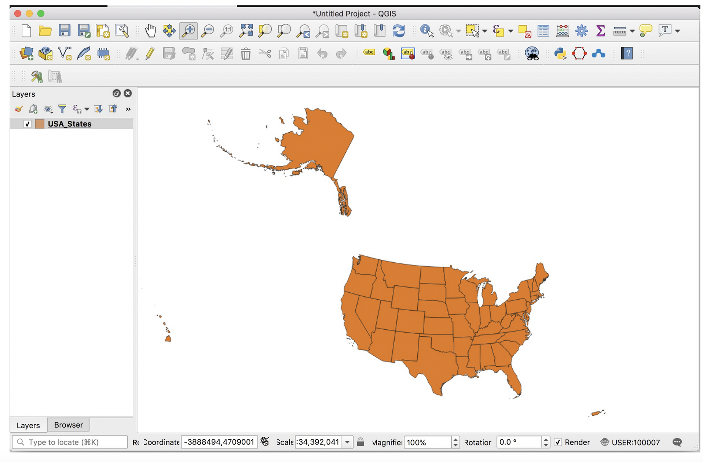
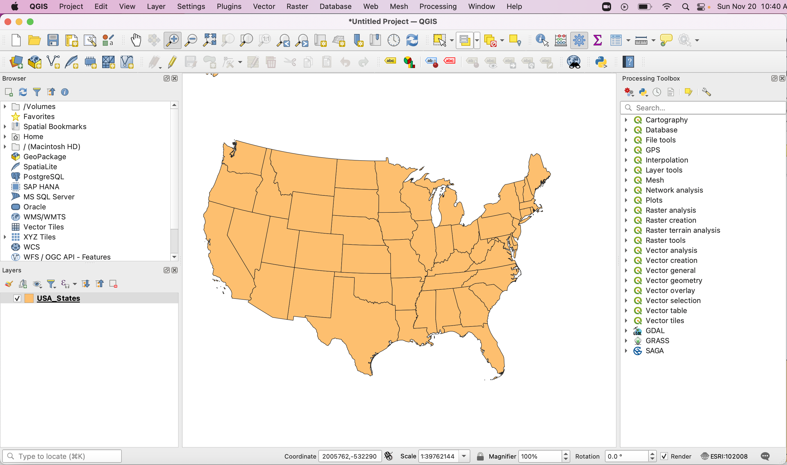
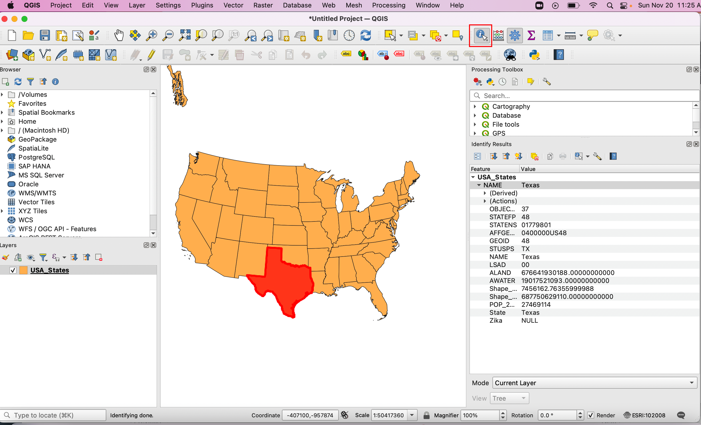
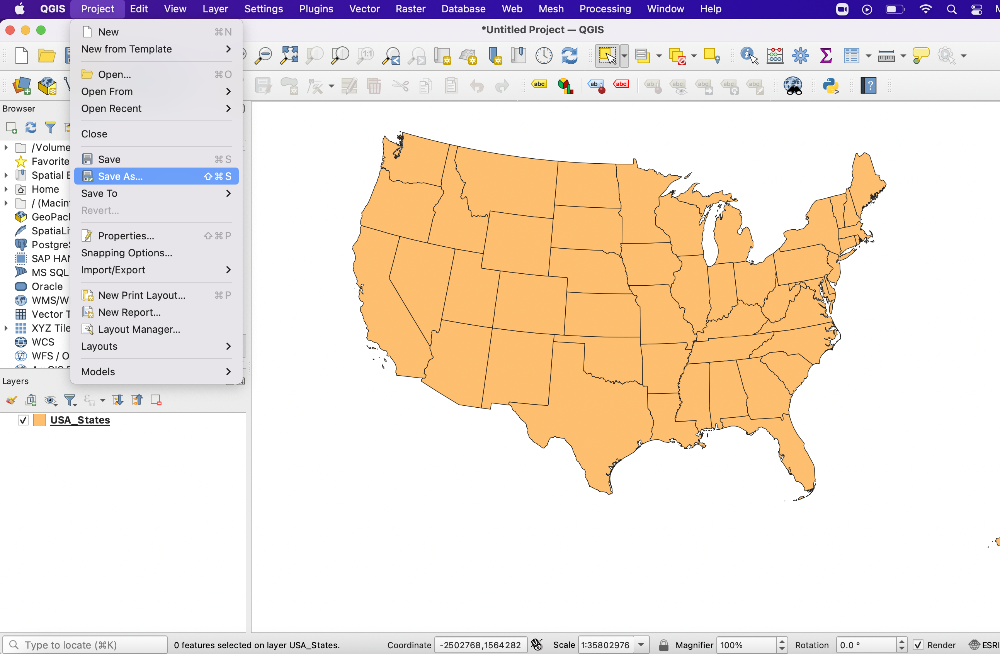

Getting Started
================== 

|

What is QGIS
-------------
QGIS is a widely used Open Source Geographic Information System (GIS) software that can be used for professional GIS work.  The software is licensed under the GNU General Public License and runs on various operating systems including Linux, Unix, Mac OSX, Windows and Android.  The software consists of a core component plus numerous plugins that add additional functionalities to the program.

In this unit, we will begin exploring QGIS.  We will do so by downloading and installing the software, learning how to load a shapefile into the software, and looking at various controls used to manipulate and examine the map layer.  

|

Downloading and Installing QGIS
---------------------------------

1. QGIS is available free of charge to anyone who wants to use it. You can download QGIS for different platforms at:
https://www.qgis.org/en/site/forusers/download.html 

2. To install QGIS, double click on rhe file you downloaded and follow the prompts.  

3. Click on the Youtube Video link below for an illustration of the installation process.

https://www.youtube.com/embed/wMBmc76Vk_4

|

Downloading Data
------------------
1. For this tutorial, please download a USA states shapefile at this link: 
https://github.com/hsemple/-Covid19/blob/master/USA-2.zip

2. After downloading the file, unzip or extract it to a location that you can remember.

|

Launching QGIS 
----------------
1. To launch QGIS on a Mac OS machine, click Finder | Application | QGIS. 

2. On Windows, click Start | All Programs | QGIS | QGIS for Desktop. 
 

3. At start-up the program may appear as shown below. Note: there may be a slight difference depending on how your computer is configured. 
 
.. image:: img/intro_qgis.png
   :alt: QGIS at startup
 
 

|

Displaying Map Layers in QGIS
------------------------------

1. To load a map layer into QGIS, click the Layer button on the main menu, then click Add  Layer. Here, we have options for loading different types of GIS datasets.  There are also options for loading layers stored as web map services or in different database software.  As we are loading a shapefile, which is a type of vector layer, click on Add Vector Layer. 
 

.. image:: img/load_vectorlayer.png
   :alt: Loading Vector Layer into QGIS

 
2. Click on the ellipsis (the three horizontal dots) to the right of the Vector Dataset(s) textbox. Browse to the folder where the data is loaded, and select the USA_States.shp file (Make sure it is not the XML file).  Click Add to add the layer to the map then close the data source manage dialog.  If you are prompted for Coordinate Systems Information, enter WGS 84 for the coordinates.

.. image:: img/data_source_manager.png
   :alt: QGIS Data Source Manager

 
3. The map layer will be added to QGIS.

 

4. If the Layers panel to the right is not visible, click on View  | Panels | Layers. The panel will be added. You may have to move panels that are blocking its view. 
 

5. Click on the video below for a quick overview of the process:

.. raw:: html

   <iframe width="560" height="315" src="https://www.youtube.com/embed/q8T82P1uBT8" title="YouTube video player" frameborder="0" allow="accelerometer; autoplay; clipboard-write; encrypted-media; gyroscope; picture-in-picture" allowfullscreen></iframe>

|

Panning the Map
----------------------------

1. Panning refers to moving the map in any direction on the screen. 

2. To pan the map, first click on the PAN tool (see illustration), then click and drag the map to various locations on the screen.  

|

Zooming the Map
-----------------

1. Zooming allows us to see the map in either greater or lesser detail. 

2. To zoom in to a particular state on the map, e.g, Texas, first click on the Zoom tool to make it active(see illustration), then click and drag a box shape over the State of Texas.  Letting go of the click button will zoom into the extent of the selection.

.. image:: img/Zoom_in_Tool.png
   :alt: Zoom in Tools

3. To zoom out, firs clik on the Zoom out button, then click on any spot on the map. The map will zoom out, centered on the selected point.

4. QGIS also has several other zoom tools (See illustration below). Please click on these tools and note their effect.  The Zoom to Layer tool is particularly important.  If you zoomed in or zoomed out too much and want to quickly return to the original extent of the map, then click on the the Zoom to Layer tool.

|

The Identify Tool
-------------------
1. The Identify tool is used to view data about a map feature that is stored in the layer's attribute table.   

2. To use the Identify tool, click on the Identify button, then click on the feature of interest.  The attributes associated with the feature will display in the Identify Results information box.

|

Selecting and Deselecting Features
-----------------------------------

1. The QGIS toolbar provides several tools to select one or more map features. To select one or several features, just click on the appropriate select tool.  

.. image:: img/deselect_features.png
   :alt: Select Feature Tool

2. To deselect all selected features click on the Deselect Features from All Layers tool.

|
 
Viewing the Attribute Table
----------------------------

1. To view the attribute table of the USA layer, right click on the name of the layer and select Open Attribute table. Inspect the data in the attribute table.

 
 
2. Notice the names of each state in the attribute table. If you select the record or row for a state, the state will be highlighted on the map.  Try it and see for yourself.  It is one of the features that make GIS software special.

.. image:: img/view_attribute_table2.png
   :alt: View Attribute Table
 

3. Investigate the numerous columns in the attribute table. Each column contains data about the characteristics of each state's population.  Looking at the numbers in each column, you may eventually see a pattern, but it takes time. To quickly visualize geographic patterns, we can map the numbers. 

|

Saving your Project
--------------------

1. To save your QGIS project, click on Project on the main menu, then select the Save As .. button. Note: when you save a project, you are saving a file that contains information on all the formatting you applied to the data you were workig with. Also, the project file does not save your data; it only saves a reference to your data.

 

In the next unit, we will do thematic mapping, which involves mapping the data in selected columns.