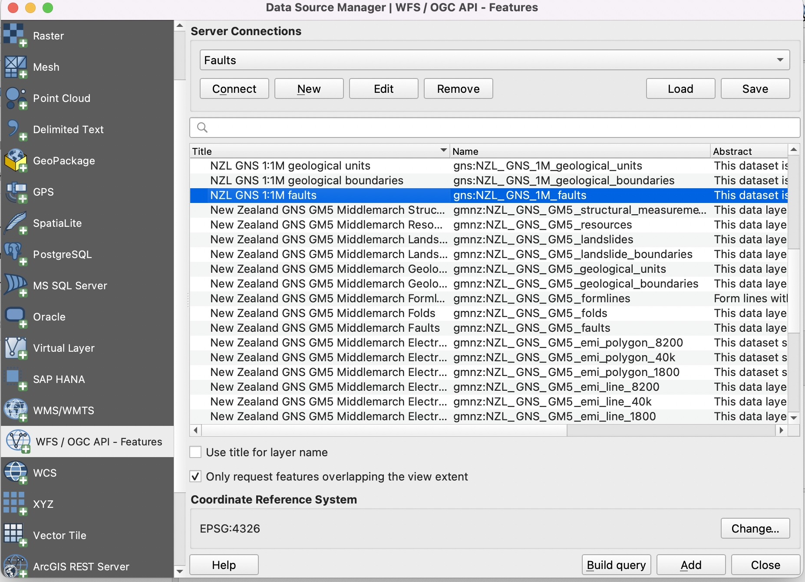
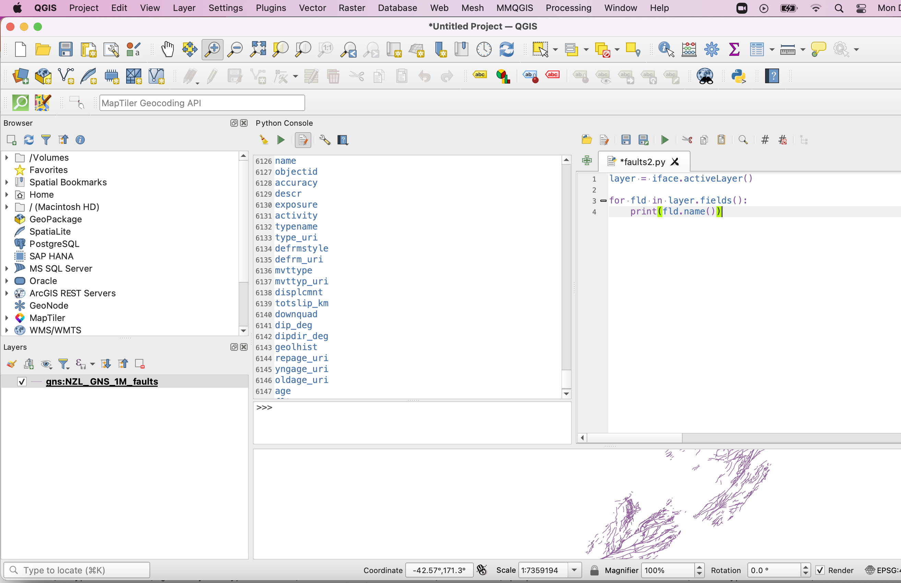

Automating Processes with Python
=================================

|

**Getting Started**

1. Add this WFS layer to QGIS. To do so, click on Add Layer | Add WFS Layer..., then select New and provide this URL: https://maps.gns.cri.nz/geology/wfs

2. Highlight the layer called NZL_GNS_250K_faults and select Add Layer to Project. 

3.  From the main menu in QGIS, select Plugins | Python Console.  This will cause the Python Console to appear. It may open up towards the bottom of the application, however, if you wish, you can detach it from the main window and place it whereever you wish.

4.  The lower part of the Console display with the >>> prompt. This is is where you type commands. T

5. The Python commands can be pure Python commands that have nothing to do with GIS or QGIS, or they can be Python commands ained at manipulating QGIS commands or user data.

6.  The iface class is used to access most graphical QGIS components. For example, to get a reference to the active layer, we can write:   

   >>> layer = iface.activeLayer()

7. Once you get a reference to the active layer object, you can access methods and properties associated with this object. For example, to get the name of the active layer, we write:
   
   >>> layer.sourceName()

8.  You should get the response in the upper half of the console

     'NZL_GNS_250K_faults'

9. Now, let us get a count of the number of features in the layer:

>>> layer.featureCount()

10. The console is great for entering simple Python commands. To enter Python scripts consisting of many lines, it is better to use the Editor Window. Let's use the Editor Window to enter a slighly longer script.

|

The Editor Window
-------------------

1.  The editor is accessed by right-clicking Show Editor in the upper part of the console.

2.  We will write a simple script to print the names of the fields in the attribute table of the WFC layer ::

      layer = iface.activeLayer()

      for fld in layer.fields():
          print(fld.name())

3. The script below get the length of each fault segment and maintains keeps a running total of the lengths ::

    layer = iface.activeLayer()
    lengths = []
    for fault in layer.getFeatures():
        lengths.append(fault.attribute("shape_len"))
        print(sum(lengths))

|

Jupyter notebook
-------------------

1. If you are familiar with Jupyter notebook, then you can use it with QGIS.  First, you must install the pyqgis modules into an environment. After than, you can with QGIS outside of the application itself. 

2. Create a Python GIS environment  - https://autogis-site.readthedocs.io/en/latest/course-info/create-python-gis-environment.html

|

Resources
------------

* Getting Started With Python Programming (QGIS3) - https://www.qgistutorials.com/en/docs/3/getting_started_with_pyqgis.html

* Customizing QGIS with Python (Full Course Material) - https://courses.spatialthoughts.com/pyqgis-in-a-day.html

* Free and Open Source GIS Ramblings - https://anitagraser.com/pyqgis-101-introduction-to-qgis-python-programming-for-non-programmers/

* GIS Python API documentation - https://qgis.org/pyqgis/master/

* PyQGIS Developer Cookbook - https://docs.qgis.org/3.16/en/docs/pyqgis_developer_cookbook/index.html

* Streamlining GIS with Automation - https://www.geospatialworld.net/prime/technology-and-innovation/streamlining-gis-with-automation/

* Python and ArcGIS Pro - https://michaelminn.net/tutorials/arcgis-pro-python/index.html

* Michael Minns Tutorials - https://michaelminn.net/tutorials/

|