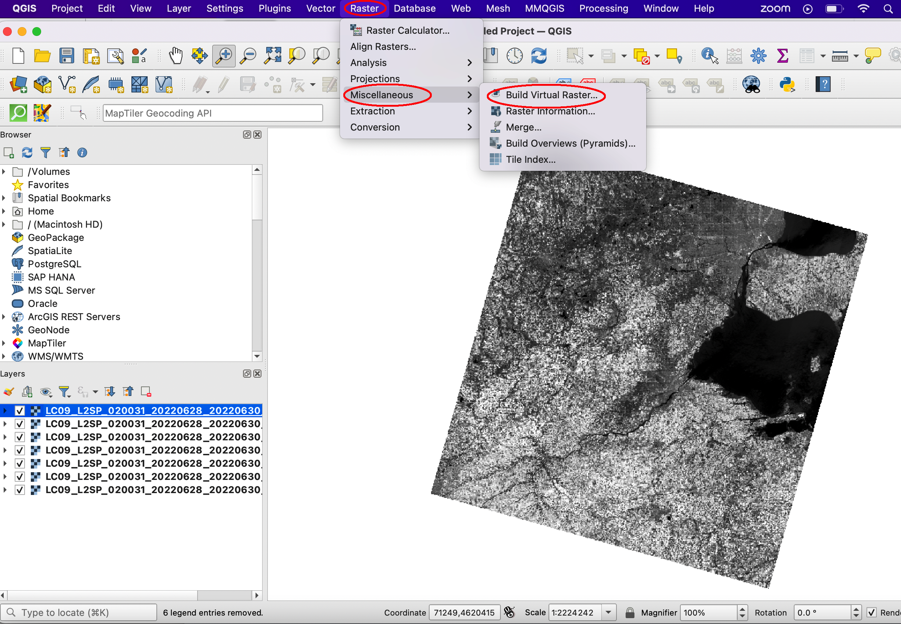

Loading Data into QGIS
========================

In GIS, spatial data refers to the points, lines, and area features that are drawn on maps to represent the geographic location of natural and human phenomena, such as mountains, rivers, roads, bridges, homicides, etc.  In general, spatial data is any data that can be mapped. 

In a computer, the points, lines and polygons that represent map features can be drawn using precise coordinates (vectors) or they can be represented by one or more contiguous cells on a grid (rasters).  

Popular vector products include shapefiles and geodatabases. Popular raster products include digital elevation models, satellite imagery, thematic rasters, orthophotos, and digital topographic maps. 

With QGIS, we can easily load the various types of spatial data into the software.  The method of loading data varies depending on the type of spatial data. The sections below describe how to load different types of spatial data into QGIS.

|

Loading Shapefiles
--------------------

1. ESRI's shapefile is one of the most common vector data file formats. One way of loading a shapefile into QGIS is to click on Layer | Add Layer | Add Vector Layer, as shown below.

.. image:: img/load_vectorlayer.png
   :alt: Loading Vector Layer into QGIS

2. A second method is to click on the Data Source Manager button (or press the Ctrl + Shift + V keyboard shortcut) to bring up the Data Source Manager dialog, which can be used to open different types of Layers.  

.. image:: img/accessing_data_source_manager.png
   :alt: Data Source Manager

|

Loading a Digital Elevation Model
-----------------------------------

1 To display a DEM in QGIS, click on Layers | Add Raster Layer, then navigate to the folder where the DEM is stored, e.g, C:/Wayne_dem24_30m/Wayne/Topography/dem/. 

2. Select the file named w001001.adf,  Make sure it is the adf file with the larger file size.

3. If the DEM is loaded and doesn’t show up, simply right click on it and select Zoom to Layer.

.. image:: img/wayne_dem.png
   :alt: Digital Elevation Model

4. The numbers below the name of the DEM in the Table of Content refer to elevation in ft.  If you click on the Identify button then click anywhere on the map, it will return the elevation at that location.

5. To change the color of the DEM, double click on its name in the Table of Content and select Symbology. Change the Render Type from SingleBand Gray to SingleBand Psuedocolor.  

6. Select a color ramp that suits your taste. Make sure the color ramp does justice in showing the subtle variations in elevation. 

.. image:: img/dem_symbology.png
   :alt: Digital Elevation Model

|

Loading an Aerial Photograph
-----------------------------

1. Download the orthophoto and unzip it to a folder that you can easily locate. 

2. Display the orthophoto in QGIS by clicking on Layers | Add Raster Layer and navigating to the folder where the file is stored.  

.. image:: img/ann_arbor_east.png
   :alt: Loading Orthophoto

|

Adding Google Satellite Imagery
---------------------------------

1. Click the Open Data Source Manager button in the toolbar

2. Right click on XYZ Tiles | New Connection…

3. In the dialog that appears, type "Google" in the Name textbox.

4. In the URL, copy and paste the address the following URL then click OK: 
:samp: 'http://mt0.google.com/vt/lyrs=y&hl=en&x={x}&y={y}&z={z}&s=Ga'

5. To view the imagery, drag the "Google Earth" button you created to the Table of Content.

6. Additional Google Map Tiles Links

  * Google Maps	https://mt1.google.com/vt/lyrs=r&x={x}&y={y}&z={z}
  * Google Satellite	https://www.google.cn/maps/vt?lyrs=s@189&gl=cn&x={x}&y={y}&z={z}
  * Google Satellite Hybrid	https://mt1.google.com/vt/lyrs=y&x={x}&y={y}&z={z}
  * Google Terrain	https://mt1.google.com/vt/lyrs=t&x={x}&y={y}&z={z}
  * Google Roads	https://mt1.google.com/vt/lyrs=h&x={x}&y={y}&z={z}

|

Loading Landsat Imagery
------------------------
1. Download Landsat 8 imagery from https://earthexplorer.usgs.gov/

2. The Landsat imagery that you download will contains several layers or bands all of which pertain to the same area.  After unzipping the data, load the files into QGIS by selecting the desired layers, as shown below.

.. image:: img/landsat_imagery1.png
   :alt: Landsat Imagery 

3. After the files are loaded, they should appear as shown below. You can uncheck and then recheck each layer to observe it in detail. You can also zoom in and inspect different parts of the imagery. 

4. Click on Raster in the main menu, then select Miscellaneous | Build Virtual Raster.  This step will combine the rasters into a single layer.  Fill out the dialog that appears.

5. Select the layers you want to use. I selected bands 1 through 8.  Click OK when you are done.

.. image:: img/multiple_selected_rasters.png
   :alt: Selecting Landsat Bands for Display in QGIS

 
6. In the main menu, click Run in Background. A new layer called "Virtual" will be created.

.. image:: img/build_virtual_raster1.png
   :alt: Building a Virtual Raster in QGIS

 
7. Right click on the layer called "Virtual" and select Properties.
 

.. image:: img/virtual_raster2.png
   :alt: Landsat Imagery in QGIS

8.  To generate an image that represents a 5-4-3 band combination, fill out the dialog similar to the illustration below. The key selections are as follows: 
* Render Type: Multiband Color
* Red Band – 5
* Green Band – 4
* Blue Band - 3.

.. image:: img/symbolizing_virtual_raster.png
   :alt: Symbolizing Virtual Rasters

9. When you are done, click Apply to view the image. Afterwards, click Ok.

10. As you may be aware, the Landsat 8 5-4-3 band combination is the traditional False Color Infrared image. It is good for identifying different types of vegetation as well as their health. Healthy vegetation appears bright red. Each shade of red represents a different type of vegetation. From visual inspection, we can detect many shades of red, however, the computer can detect lots more shade.
    
11. Now, display an image using a 5-6-4 band combination. This is also a popular band combination for looking at vegetation cover. It contains two infrared bands (bands 5 and 6). Different vegetation types can be clearly defined, appearing as shades of orange and green. 

12. In the 5-6-4 band combination, land/water interface is very clear and for this reason, this is probably the most common band combination in Landsat 8 for differentiating between land and water.  Lakes and ponds of varying sizes can be easily identified. Water appears in shades of dark blue to black.  Ice, if present, stands out as a vibrant magenta color.

13 Display an image using a 7-6-4 band combination. This combination is useful for visualizing urban environments, particularly in situations where haze is an issue. 

|

Importing CSV files
--------------------

To add a csv file to QGIS, follow these steps:

1. Click on Layer | Add Layer | Add Delimited Text Layer.

2. Browse to the CSV file.

3. Fill out the dialog. If the CSV files contains latitude/longittude data, ensure that you define the X field and Y field that contains Longitude and Latitude values.   

4. When you are done filling out the dialog, click Ok. QGIS will read and load the CSV file. Also, the points associated with the coordinates will appear on the screen.
             

|

Loading GPS Data
------------------
1. Data downloaded from GPS receivers is often available in GPX (GPS eXchange) format.

2. To load GPX data into QGIS, first click on the Data Source Manager button, then click on GPS.

3. Navigate to the GPX file and load it into QGIS.

4. Click Ok. QGIS will read and load the GPX file. It will also display the points on the screen as waypoints or routes, as shown below.
          

|

Loading PostgreSQL/PostGIS Layers
-------------------------------------

To visualize datasets in PostgreSQl/PostGIS from within QGIS, follow the steps below:

1. In QGIS, click on Layer | Add Layer | Add PostGIS Layers.

2. In the dialog that appears, click "New". This opens the dialog to connect to the PostGIS server and database. Enter the connection information and click Ok.

3. Back in the Connection dialog, click "Connect". If the connection is successful, you will be able to see all tables in the database. 

4. Select any table of interest and click “Add”.  This will load the layer into QGIS.

 

|

Loading WMS Layer
-------------------

To Add a WMS Layer

1. In QGIS, click on Layer | Add WMS/WMTS Layer.

2. Select "New" in the Data Source Manager dialog box.

3. In the 'Create a new WMS connection' dialog, enter a name for the conection and the appropriate URL (e.g. https://mrdata.usgs.gov/services/active-mines?version=1.3.0)

.. image:: img/new_wms_connection.png
   :alt: GPS Data  

4. Select OK.

5. In the Sever Connection dialog, select "Connect" and then "Add". THe WMS layer should now be added.

.. image:: img/wms_connection_dialog.png
   :alt: GPS Data  

6. Select Close.

|

Loading WFS Layer
-------------------

1. In QGIS, click on Layer | Add WFS Layer.

2. Select New in the Data Source Manager dialog.
   
3. In the 'Create a new WFS connection' dialog box, enter a name for the connection and the appropriate URL. (e.g. https://services.ga.gov.au/gis/services/Foundation_Electricity_Infrastructure/MapServer/WFSServer?request=GetCapabilities&service=WFS)

4. Select OK.

5. In the Server Connection dialog box, select Connect and then Apply. NB - loading the WFS data may take a while.
   
6. Select Close.

|

Adding an ArcGIS REST Service to QGIS
--------------------------------------
https://www.northrivergeographic.com/qgis-adding-a-naip-wms-service-from-the-usda

