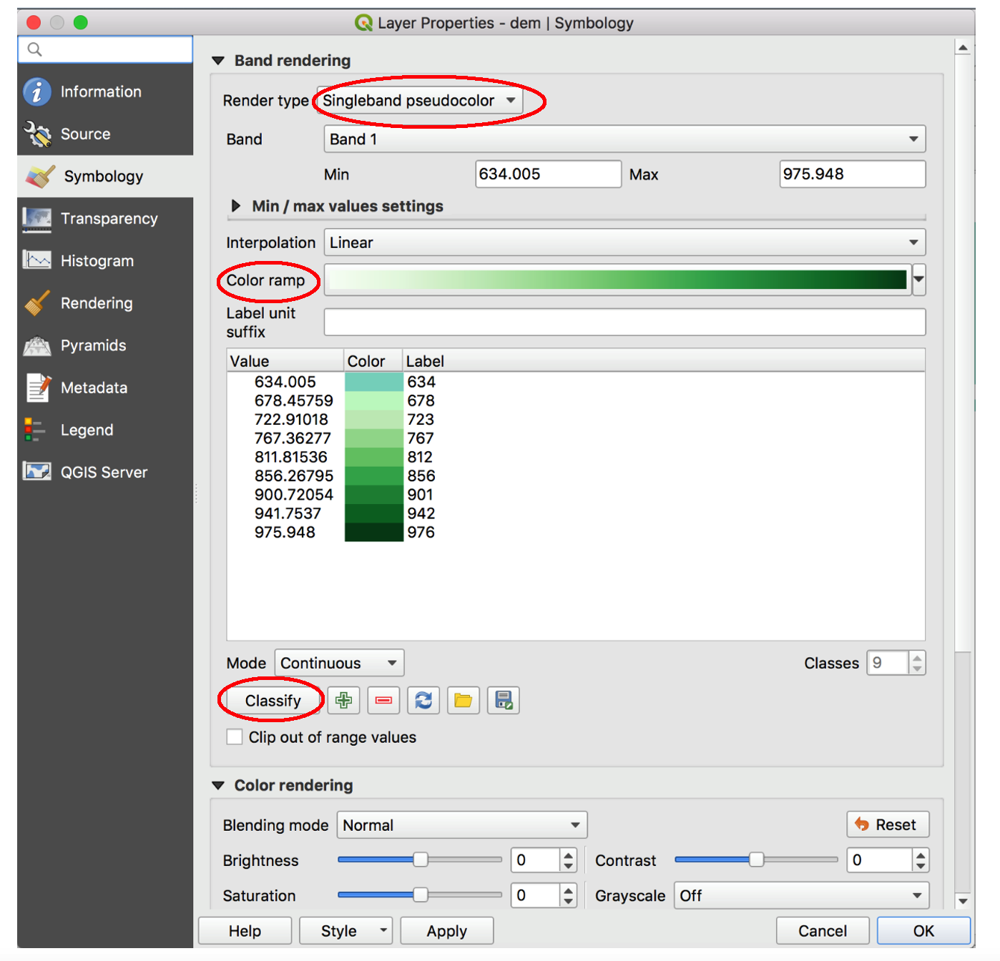

Loading Data into QGIS
========================

In GIS, spatial data refers to the points, lines, and area features that are drawn on maps to represent the geographic location of natural and human phenomena, such as mountains, rivers, roads, bridges, homicides, etc.  In general, spatial data is any data that can be mapped. 

The points, lines and polygons that represent map features can be drawn using precise coordinates (vector data) or they can be represented by one or more contiguous cells  on a grid (raster data).  

Popular vector products include shapefiles and geodatabases, which are sets of files used to represents points, lines, and polygons. Popular raster products include digital elevation models, satellite imagery, thematic rasters, orthophotos, and digital topographic maps. 

With QGIS, we can  easily load the various types of spatial data mentioned above into the software.  The method of loading data varies depending on the type of spatial data. The sections below describe how to load different types of spatial data into QGIS.

|

Loading Shapefiles
--------------------

1. ESRI's shapefile is one of the most common vector data file formats. One way of loading a shapefile into QGIS is to click on Layer | Add Layer | Add Vector Layer, as shown below.

.. image:: img/load_vectorlayer.png
   :alt: Loading Vector Layer into QGIS

2. A second method is to click on the Data Source Manager button (or press the Ctrl + Shift + V keyboard shortcut) to bring up the Data Source Manager dialog, which can be used to open different types of Layers.  

.. image:: img/accessing_data_source_manager.png
   :alt: Data Source Manager

|

Loading a Digital Elevation Model
-----------------------------------

1 To display a DEM in QGIS, click on Layers | Add Raster Layer, then navigate to the folder where the DEM is stored, e.g, C:/Wayne_dem24_30m/Wayne/Topography/dem/. 

2. Select the file named w001001.adf,  Make sure it is the adf file with large file size.

3. If the DEM is loaded and doesn’t show up, simply right click on it and select Zoom to Layer.

.. image:: img/wayne_dem.png
   :alt: Digital Elevation Model

4. The numbers below the name of the DEM in the Table of Content refer to elevation in ft.  If you click on the Identify button then click anywhere on the map, it will return the elevation at that location.

5. To change the color of the DEM, double click on its name in the Table of Content and select Symbology. Change the Render Type from SingleBand Gray to SingleBand Psuedocolor.  

6. Select a color ramp that suits your taste. Make sure the color ramp does justice in showing the subtle variations in elevation. 

|

Loading an Aerial Photograph
-----------------------------

1. Download the orthophoto and unzip it to a folder that you can easily locate. 

2. Display the orthophoto in QGIS by clicking on Layers | Add Raster Layer and navigating to the folder where the file is stored.  

.. image:: img/ann_arbor_east.png
   :alt: Loading Orthophoto

|

Adding Google Satellite Imagery
---------------------------------

1. Click undefinedbutton in the toolba

2. Right click on XYZ Tiles > New Connection…

3. In the dialog that appears, type "Google" in the Name textbox.

4. In the URL, copy and paste the address below, then click OK. 
   http://mt0.google.com/vt/lyrs=y&hl=en&x={x}&y={y}&z={z}&s=Ga

.. image:: img/google_earth_connection.png
   :alt: Loading Google Earth Imagery

5. To view the imagery, drag the "Google Earth" button you created to the Table of Content.

6. Additional Google Map Tiles Links

  Google Maps	https://mt1.google.com/vt/lyrs=r&x={x}&y={y}&z={z}
  Google Satellite	https://www.google.cn/maps/vt?lyrs=s@189&gl=cn&x={x}&y={y}&z={z}
  Google Satellite Hybrid	https://mt1.google.com/vt/lyrs=y&x={x}&y={y}&z={z}
  Google Terrain	https://mt1.google.com/vt/lyrs=t&x={x}&y={y}&z={z}
  Google Roads	https://mt1.google.com/vt/lyrs=h&x={x}&y={y}&z={z}

|

Add Landsat Imagery
---------------------

|

Importing CSV files
-------------------

To add ta csv file to QGIS, follow these steps:

1. Click on Layer | Add Layer | Add Delimited Text Layer.

2. Browse to the CSV file.

4. fill out the dialog. If the CSV files contains latitude/longittude data, ensure that you define the X field and Y field that contains Longitude and Latitude values.   

5. When you are done filling out the dialog, click Ok. QGIS will read and load the CSV file. Also, the points associated with the coordinates will appear on the screen.
             

|

Loading GPS data
------------------
1. Data downloaded from GPS receivers is often available in GPX (GPS eXchange) format.

2. To load GPX data into QGIS, first click on the Data Source Manager button, then click on GPS.

3. Navigate to the GPX file and load it into QGIS.

|

Loading Spatial Data Stored in a PostgreSQL/PostGIS Database
-----------------------------------------------------------------

To visualize datasets in PostgreSQl/PostGIS from within QGIS, follow the steps below:

1. Open QGIS, select Layer -> Add layer -> Add PostGIS layers, it should open the interface to connect a PostGIS table.

2. In the dialog that appears, click “New”, it should open the dialog to configure the PostGIS server, and database. Enter relevant information in Step 3, click Ok

3. Back to the dialog, click “Connect”, you shall be able to see all tables in the database. You may select any table, click “Add”, then you can load it into the QGIS.

 

|

Loading WMS Layer
-------------------

To Add a WMS Layer

1. Select New in the 'Add Layer(s) from a Server' dialogue box.

2. In the 'Create a new WMS connection' dialogue box, enter a name for the conection and the appropriate URL. (e.g. https://services.ga.gov.au/gis/services/Earthquake_Hazard_WM/MapServer/WMSServer?request=GetCapabilities&service=WMS)

3. Select OK.

4. In the 'Add Layer(s) from a Server' dialogue box, select Connect and then Add. THe WMS should now be added.

5. Select Close.

|

Loading WFS Layer
-------------------

1. Select New in the 'Add WFS Layer from a Server' dialogue box.
   
2. In the 'Create a new WFS connection' dialogue box, enter a name for the connection and the appropriate URL. (e.g. https://services.ga.gov.au/gis/services/Foundation_Electricity_Infrastructure/MapServer/WFSServer?request=GetCapabilities&service=WFS)

3. Select OK.

4. In the 'Add WFS Layer from a Server' dialogue box, select Connect and then Apply. NB - loading the WFS data may take a while.
   
5. Select Close.

|

Adding a NAIP REST Service from the USDA
------------------------------------------
https://www.northrivergeographic.com/qgis-adding-a-naip-wms-service-from-the-usda

