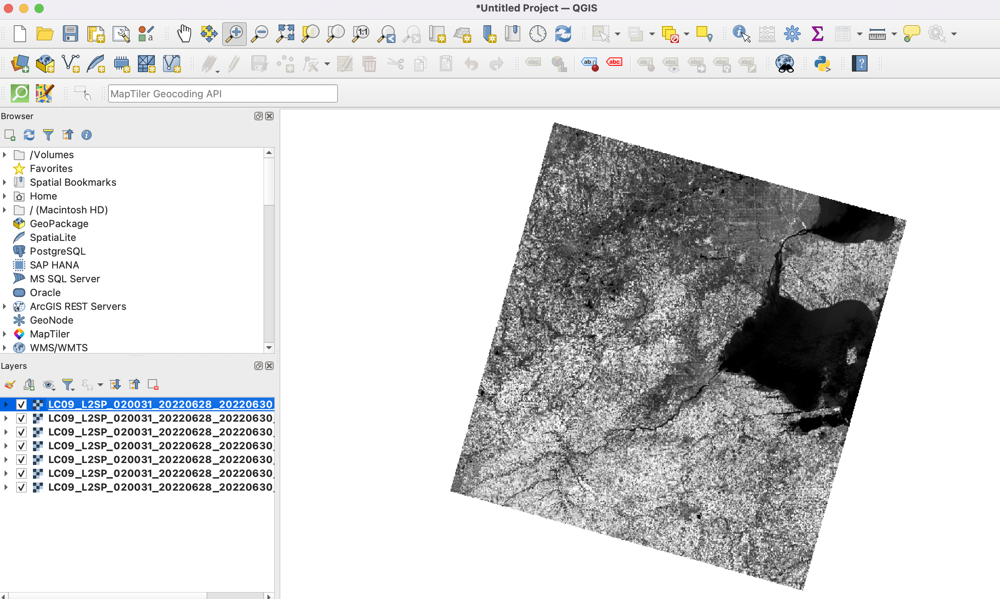
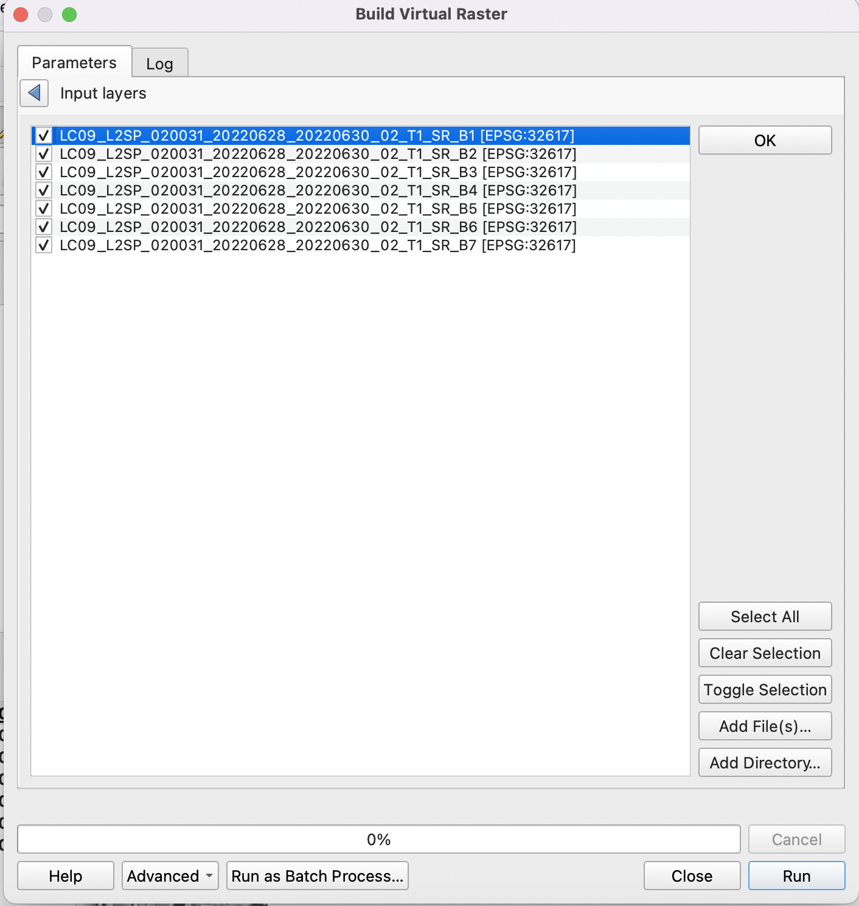
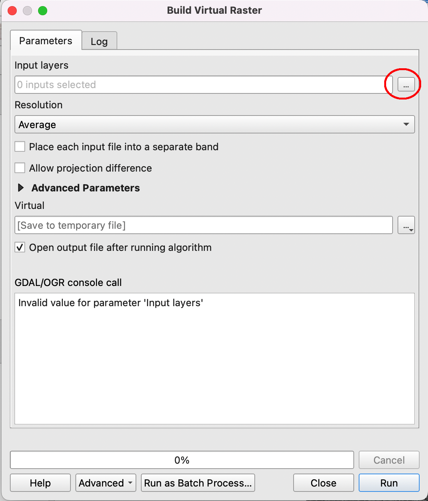

Loading Data into QGIS
========================

In GIS, spatial data refers to the points, lines, and area features that are drawn on maps to represent the geographic location of natural and human phenomena, such as mountains, rivers, roads, bridges, homicides, etc.  In general, spatial data is any data that can be mapped. 

The points, lines and polygons that represent map features can be drawn using precise coordinates (vector data) or they can be represented by one or more contiguous cells  on a grid (raster data).  

Popular vector products include shapefiles and geodatabases, which are sets of files used to represents points, lines, and polygons. Popular raster products include digital elevation models, satellite imagery, thematic rasters, orthophotos, and digital topographic maps. 

With QGIS, we can  easily load the various types of spatial data mentioned above into the software.  The method of loading data varies depending on the type of spatial data. The sections below describe how to load different types of spatial data into QGIS.

|

Loading Shapefiles
--------------------

1. ESRI's shapefile is one of the most common vector data file formats. One way of loading a shapefile into QGIS is to click on Layer | Add Layer | Add Vector Layer, as shown below.

.. image:: img/load_vectorlayer.png
   :alt: Loading Vector Layer into QGIS

2. A second method is to click on the Data Source Manager button (or press the Ctrl + Shift + V keyboard shortcut) to bring up the Data Source Manager dialog, which can be used to open different types of Layers.  

|

Loading a Digital Elevation Model
-----------------------------------

1 To display a DEM in QGIS, click on Layers | Add Raster Layer, then navigate to the folder where the DEM is stored, e.g, C:/Wayne_dem24_30m/Wayne/Topography/dem/. 

2. Select the file named w001001.adf,  Make sure it is the adf file with large file size.

3. If the DEM is loaded and doesn’t show up, simply right click on it and select Zoom to Layer.

.. image:: img/wayne_dem.png
   :alt: Digital Elevation Model

4. The numbers below the name of the DEM in the Table of Content refer to elevation in ft.  If you click on the Identify button then click anywhere on the map, it will return the elevation at that location.

5. To change the color of the DEM, double click on its name in the Table of Content and select Symbology. Change the Render Type from SingleBand Gray to SingleBand Psuedocolor.  

6. Select a color ramp that suits your taste. Make sure the color ramp does justice in showing the subtle variations in elevation. 

.. image:: img/dem_symbology.png
   :alt: Digital Elevation Model

|

Loading an Aerial Photograph
-----------------------------

1. Download the orthophoto and unzip it to a folder that you can easily locate. 

2. Display the orthophoto in QGIS by clicking on Layers | Add Raster Layer.

3. Navigate to the folder where the file is stored and select the image file.  

.. image:: img/ann_arbor_east.png
   :alt: Loading Orthophoto

|

Adding Google Satellite Imagery
---------------------------------

1. Click on the XYZ button in QGIS Explorer browser, then right click on XYZ Tiles > New Connection…

2. In the dialog that appears, type "Google" in the Name textbox.

3. In the URL, copy and paste the address below, then click OK. 
   http://mt0.google.com/vt/lyrs=y&hl=en&x={x}&y={y}&z={z}&s=Ga

.. image:: img/google_earth_connection.png
   :alt: Loading Google Earth Imagery

4. To view the imagery, drag the "Google Earth" button you created to the Table of Content.

5. Additional Google Map Tiles Links:

  * Google Maps:	    https://mt1.google.com/vt/lyrs=r&x={x}&y={y}&z={z}
  * Google Satellite:	https://www.google.cn/maps/vt?lyrs=s@189&gl=cn&x={x}&y={y}&z={z}
  * Google Satellite Hybrid: 	https://mt1.google.com/vt/lyrs=y&x={x}&y={y}&z={z}
  * Google Terrain:	    https://mt1.google.com/vt/lyrs=t&x={x}&y={y}&z={z}
  * Google Roads:       https://mt1.google.com/vt/lyrs=h&x={x}&y={y}&z={z}

|

Add Landsat Imagery
---------------------
1. Download Landsat 8 imagery from https://earthexplorer.usgs.gov/

2. The Landsat imagery that you download will contains several layers or bands all of which pertain to the same area.  

3. After unzipping the data, load the files into QGIS by selecting the desired layers, as shown below.

4. After the files are loaded, they should appear as shown below. You can uncheck and then recheck each layer to observe it in detail. You can also zoom in and inspect different parts of the imagery. 

.. image:: img/imagery_in_qgis.png
   :alt: Landsat Imagery in QGIS

5. Click on Raster in the main menu, then select Miscellaneous | Build Virtual Raster.  This step will combine the rasters into a single layer.  Fill out the dialog that appears.

.. image:: img/virtual_raster.png
   :alt: Landsat Imagery in QGIS

6. Select the layers you want to use. I selected bands 1 through 8.  Click OK when you are done.

 
7 In the main menu, click Run in Background. A new layer called "Virtual" will be created.

 
8. Right click on the layer called "Virtual" and select Properties.
 

9.  To generate an image that represents a 5-4-3 band combination, fill out the dialog similar to the illustration below. The key selections are as follows: Render Type: Multiband Color; Red Band – 5; Green Band – 4; Blue Band - 3.

.. image:: img/symbolizing_virtual_raster.png
   :alt: Landsat Imagery in QGIS

10. When you are done, click Apply to view the image. Afterwards, click Ok.

11. Now, display the Virtual raster layer using the 5-4-3 band combination given below.  The resultant image is the traditional False Color Infrared image. It is good for identifying different types of vegetation as well as their health. Healthy vegetation appears bright red. Each shade of red represents a different vegetation. From visual inspection, we can detect many shades of red. The computer can detect lots more shade.

12. Display the Virtual raster layer using the 5-6-4 band combination.  Similar to 5-4-3, this is a popular band combination for looking at vegetation cover. It contains two infrared bands (bands 5 and 6). Different vegetation types can be clearly defined, appearing as shades of orange and green. The land/water interface is also very clear and for this reason, this is probably the most common band combination in Landsat 8 for differentiating between land and water.  Lakes and ponds of varying sizes can be easily identified. Water appears in shades of dark blue to black.  Ice, if present, stands out as a vibrant magenta color.

|

Importing CSV files
-------------------

To add a csv file to QGIS, follow these steps:

1. Click on Layer | Add Layer | Add Delimited Text Layer.

2. Browse to the CSV file and fill out the dialog.

3. If the CSV file contains latitude/longittude data, ensure that you define the X field and Y field that contains Longitude and Latitude values.   

4. When you are done filling out the dialog, click Ok. QGIS will read and load the CSV file. Also, the points associated with the coordinates will appear on the screen.
             

|

Loading GPS Data
------------------
1. Data downloaded from GPS receivers is often available in GPX (GPS eXchange) format.

2. To load GPX data into QGIS, first click on the Data Source Manager button, then click on GPS.

3. Navigate to the GPX file and load it into QGIS.

|

Loading PostgreSQL/PostGIS Data
---------------------------------

To visualize datasets in PostgreSQl/PostGIS from within QGIS, follow the steps below:

1. In QGIS, click on Layer | Add layer | Add PostGIS Layers.

2. In the dialog that appears, click “New”.  This will open a dialog to connect to the PostGIS server, and database. Enter relevant information and click Ok

3. Back in the the main Connection dialog, click “Connect”.  

4. All the tables in the PostGIS database will now be visible.  Select any table and click “Add”.  The tqble will be added to  QGIS.

 

|

Loading WMS Layer
-------------------

1.  In QGIS, click on Layer | Add layer | Add WMS/WMTS Layers

2. In the 'Create a new WMS connection' dialog, enter a name for the conection and the appropriate URL. (e.g. https://services.ga.gov.au/gis/services/Earthquake_Hazard_WM/MapServer/WMSServer?request=GetCapabilities&service=WMS)

3. Select OK.

4. Back in the the main Connection dialog, select Connect and then Add. If the URL is correct, the WMS layer should be added to the View.

5. Select Close.

6. Click on this link for examples of WMS geology layers - https://mrdata.usgs.gov/wms.html

|

Loading WFS Layer
-------------------

1. In QGIS, click on Layer | Add layer | Add WFS Layer
   
2. In the 'Create a new WFS connection' dialog, enter a name for the connection and the appropriate URL(e.g. https://services.ga.gov.au/gis/services/Foundation_Electricity_Infrastructure/MapServer/WFSServer?request=GetCapabilities&service=WFS)

3. Select OK.

4. In the 'Add WFS Layer from a Server' dialog box, select Connect and then Apply. Note: Loading the WFS data may take a while.
   
5. Select Close.

|

Adding a NAIP REST Service from the USDA
------------------------------------------
https://www.northrivergeographic.com/qgis-adding-a-naip-wms-service-from-the-usda

