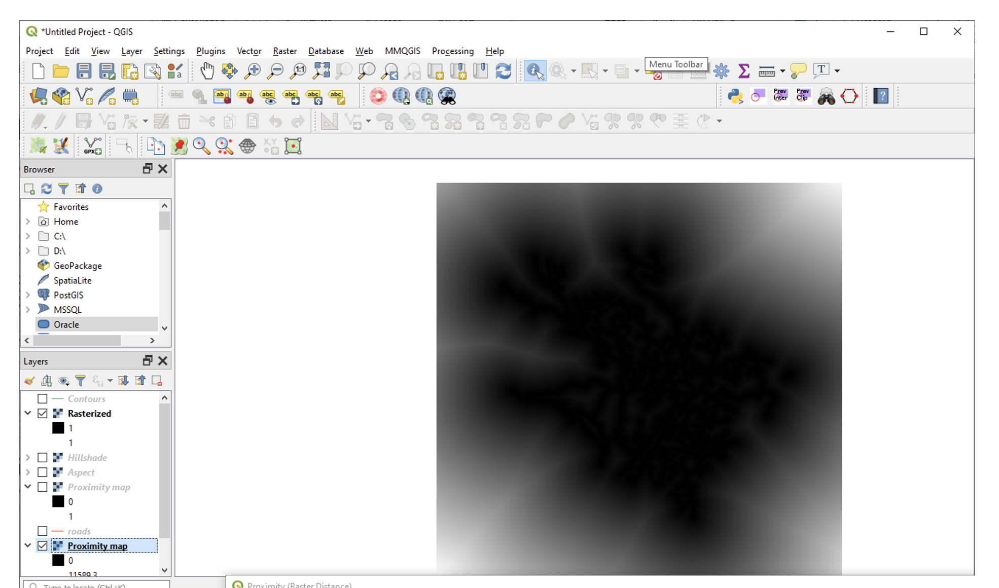
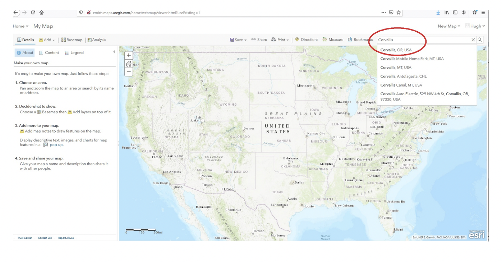

Terrain Analysis
==================================

|

Obtain Basic Terrain Information from Elevation Maps
---------------------------------------------------------

Visit Stowe, VT using `Caltopo <https://caltopo.com/>`_, `the National Map <https://apps.nationalmap.gov/viewer/>`_, Google Earth Pro, QGIS, or ArcGIS Pro. Locate the following two points (44.535252, -72.781882; 44.437931, -72.761282) then determine the following:

1.	the elevation of each of the two points.
2.	the straight line distance between the two points.
3.	the slope between the two points.
4.	the aspect between the two points.

|

Creating Basic Terrain Maps
-----------------------------

Visit the `National Map data downloader <https://apps.nationalmap.gov/downloader/>`_ and download a DEM for a small area in a mountainous region in the USA. Load the DEM into the QGIS, then generate and submit the following professional quality maps of the area.

•	a hillshade map (hysometric tinting)
•	a slope map 
•	an aspect map  
•	a contour map
•  a profile curvature map

Create well organized hillshade, slope, aspect and contour for submission. Your maps should attractive and professionally created.  Pay keen attention to map colors, and legend, scale bar design, and title design. 

After generating the maps, briefly state two practical uses of each of the above maps.

|

**Procedure for Generating Terrain Maps**

1. Download the DEM from the National Map then unzip the files to a folder whose path you can remember. I downloaded a DEM for the Stowe, Vermont area.

2. Launch QGIS.

3. Click on Layer | Add Layer | Add Raster Layer

4. Navigate to the folder where the DEM is loaded and select the .adf file that has the larger file size.

 
5. Click Add and Close. The DEM will be added to QGIS.  

.. image:: img/terrain_analysis2_loaddem.png
   :alt: Select adf file

6. Now, let's explore the DEM. At first glance, the DEM looks a bit weird, but you can see outlines of stream channels and ridges.  Click `here <https://www.google.com/maps/place/Stowe,+VT+05672/@44.4593029,-72.8832422,11z/data=!4m5!3m4!1s0x4cb591352b365ed5:0x26c5ba3745132901!8m2!3d44.4654332!4d-72.6874023!5m1!1e4>`_ to view the area on Google Map.  

7. To explore the elevation of the area, click on the Identify button (see illustration below) and then click anywhere on the DEM. QGIS will return the elevation value at that location.

.. image:: img/terrain_anaysis3_identify.png
   :alt: Select adf file

8. Now, let us inspect the properties of the DEM. Right click on the layer's name in the Table of Content, then select properties.  Click on Source. Here, you can see the DEM's coordinate system information. To learn more about the coordinate system, click on the icon to the right of the screen. The dialog to the left of the screen will appear.

9. In the dialog that contains the coordinate system information, inspect the information under "Selected CRS".  You can see that it includes 'Extent', which are the longitude / latitude values of the geographic area occupied by the map layer. The four coordinates are the long/lat for the lower left position and upper right position of the bounding area.

10. Proj4 provides details about the coordinate system. Proj = tmerc means that the projection is Transverse Mercator. The lat/long give the central meridian of the coordinates on the map. You can also see that the ellipsoid is GRS 1980. The towgs84 parameter gives values for translating this coordinate system into WGS 1980.  The zeroes mean that the two systems have the same dimension. Map units is meters. False Easting (+x_0) is 500000 and false northing (+y_0) is 0.

11. Try to answer the questions below regarding the DEM's coordinate system:
 
 * What is the coordinate system of the DEM? 

 * What is the map units of the coordinate system? 

 * What are the minimum and maximum elevations in the DEM?

|

**Create a Hillshade Map**

1.  To create a hillshade map, click on Raster | Analysis | Hillshade. 

.. image:: img/terrain_analysis_hillshade1.png
   :alt: Hillshade

2.  In the hillshade dialog that appears, make sure that you select the elevation model as your input (see illustration below). Inspect the other values, but do not change them. Take note of the default Azimuth of the light source (compass direction of the light source) and altitude of the light source.  These are all textbook recommended values for hillshade creation. Try to visualize what they mean.   

.. image:: img/terrain_analysis_hillshade2.png
   :alt: Hillshade

3. Do not provide an output name in "Save to temporary file" as you may get an error. Click Run.

4. The hillshade map appears as shown below. Notice how easy it is to visualize the ridges and valleys compared to the original DEM.

.. image:: img/terrain_analysis_hillshade3.png
   :alt: Hillshade
 
5. Visualizing terrain is one of the most common uses of hillshades.  To enhance visualization, we often drape rasters and shapefiles over hillshades to give the area a more realistic look.  We will now drape our DEM over the hillshade.  

6. Drag the DEM and place it above the hillshade in the Table of Contents.  Now, double click on the name of the DEM and select the Transparency tab. Select the Global Opacity Slider and set it to about 50% transparent. Click Apply.  Now, it is possible to better visualize the DEM.

.. image:: img/terrain_analysis_hillshade4.png
   :alt: Hillshade
  
7. For even greater visual effect, you can change the color scheme of the DEM.  Select the Symbology tab that is above the Transparency tab. Change the Render type to psuedoband single color, then play with the color schemes. Select one that pleases you and that displays terrain data well.

8.  When you are done, click Ok. The results should appear as shown below.  Appearance may vary slightly depending on the color you selected.  You can also compare your hillshade with Google Map's hillshade of Stowe. Click here  to view it.

9. To see some interesting work done on the design of hillshades, check this link: https://www.esri.com/arcgis-blog/products/arcgis-pro/mapping/steal-this-imhof-like-topography-style-please/.

10. Make a professional layout of this map for submission.  
 

|

**Create a Slope Map**

1. To create a slope map of the Stowe, Vermont area, click on Analysis | Tools | Toolboxes | Surface | Slope.

  
2. Fill out the Slope dialog. Make sure that you selected the Stowe digital elevation model as your input, not the previous hillshade. No other change is required. Use default settings. Click Run.

3. The resultant map is shown below.

  
4. Change the color scheme.  

.. image:: img/terrain_analysis_slope3.png
   :alt: Slope

 
5. For improved visualization, you can drape the slope map over the hillshade. 

6. Make a professional layout of this map for submission. To aid with your cartography, here is an example of a nicely drawn slope map  - https://kingsgeocomputation.org/2016/03/16/aspect-slope-maps-in-qgis/

|

**Create an Aspect Map**

1. As discussed in this Module, aspect maps provide information on the direction that each slope faces. Some slopes are northward facing slopes, others face the south, east, east north east, west, etc.    Aspect is measured in terms of angles.
 
2. To create an aspect map in ArcGIS Pro, click again on Toolboxes | Spatial Analyst Tools | Surface | Aspect, then fill out the dialog.  Make sure that you select the Stowe digital elevation model as your input.

3. Select an appropriate color scheme and drape it over the hillshade.

  
4. Make a professional layout of this map for submission.

|

  
**Create a Contour Map**

1. Click on Raster | Extraction then select Contours.

 
2. Make sure you select the elevation layer as the input raster.  Set a contour interval of 50ft, then click Ok. If you do not like the results, you can try different contours intervals.
 
 
.. image:: img/terrain_analysis_contours2.png
   :alt: Contours

|

*Labeling the Contour Map*

The first image below shows basic contour labeling with the contour placed on the lines.  The halo hides the lines where the numbers intersect the lines. Your task is to generate these cartographically pleasing labels. 

To create labels, do the following:

1.	Right click on the contour shapefile, select Properties, then  select 'Label'. Select Elev as the field in the attribute table to use for labeling. This will add labels to your contours.  However, the labels are placed above the contour lines, and hence, need editing.  On contour labels are placed on the lines, "breaking" the lines in the process, as shown in the illustration above.

2. Select "Placement", then select all three options. Note their effect on the lines. Select the one that best works for you. 

3. Click on Background to set halo effect. Fiddle with the color settings. I think setting the opacity values improves the background effect considerably.  Ideally, the halo colors should merge seamlessly with the background color of the contours.

4. Click Apply.

.. image:: img/terrain_analysis_contours4.png
   :alt: Contours

  

|

Profile Graph, line-of-sight Graph, and Viewshed Maps
------------------------------------------------------

Using the two points mentioned in Section 1 (44.535252, -72.781882; 44.437931, -72.761282), generate a  profile graph and a line of sight chart for the two points.  Also, generate a viewshed from point 44.535252, -72.781882. Use QGIS, Google Map, or any software of your choice to generate these products.

**Profile Graph**

*QGIS*

1. Create a new line layer snapping to your start and end points.

2. Get the Profile tool from the Plugins menu, search for Profile. 

3. Open the profile tool.

4. In the profile tool there is a drop down box called "Selection" by default it has a value of "Temporary polyline" change that to "Selected Polyline".

5. Your cursor when in the map will change to a pointer finger, click on your polyline with the cursor and your profile will draw.

|

**Line-of-Sight Graph**

1. YouTube Video

.. raw:: html

 <iframe width="560" height="315" src="https://www.youtube.com/embed/0NTw7hujRCQ" title="YouTube video player" frameborder="0" allow="accelerometer; autoplay; clipboard-write; encrypted-media; gyroscope; picture-in-picture" allowfullscreen></iframe> 
   

2. See also this tutorial - https://analyticalgraphics.force.com/faqs/articles/Knowledge/Line-of-sight-analysis-from-shapefile-building-data

|

**Viewshed Map**

In QGIS, to create a viewshed map, you must first create a viewpoint layer. After than, you use the view point layer to create the viewshed layer.  Click on the videos below for the detailed steps :

1. YouTube Video

.. raw:: html

   <iframe width="560" height="315" src="https://www.youtube.com/embed/fGKgvg0QoXA" title="YouTube video player" frameborder="0" allow="accelerometer; autoplay; clipboard-write; encrypted-media; gyroscope; picture-in-picture" allowfullscreen></iframe>
   
   

2. YouTube Video

.. raw:: html

  <iframe width="560" height="315" src="https://www.youtube.com/embed/kC1ApQLcEhM" title="YouTube video player" frameborder="0" allow="accelerometer; autoplay; clipboard-write; encrypted-media; gyroscope; picture-in-picture" allowfullscreen></iframe>    
   

3. See also this tutorial- https://landscapearchaeology.org/2020/visibility-index/

|

Habitat Suitability Analysis
-----------------------------

The habitat for a certain animal in Stowe, Vermont must be protected.  Preliminary studies show that the habitat for the animal is generally associated with the following very broad geographic conditions:

a. elevation greater than 800 ft
b. slope between 20 to 30 degrees
c. southward facing aspect, i.e., between 90 and 270 degrees
d. more than 1 km from roads
e. forested areas
 
Use QGIS to identify locations that meet all of the above conditions.  
 
|

**Procedure**

The basic logic in any habitat suitability analysis is to assemble map layers for each of the project criteria and then query the map layers to find locations that meet all of the criteria.  In this example, you have to assemble the following maps:

•	an elevation map. In this case, we already have the Stowe DEM.
•	a slope map, which, as you noted above, can be generated from the DEM
•	an aspect map, which, as you noted above, can also be generated from the DEM
•	a map showing distance from roads, which we will generate using GIS
•	a map showing forested areas, which will extract from the land use map that was provided.
 
 

|

**Assembling Map Layers**

1. The first layer needed is the elevation layer.  Since this layer is provided, no further processing is required. Simply load it into QGIS.
   

2. The second layer needed is a slope layer.  This layer is also available from the previous section, so we can reuse it. 

.. image:: img/terrain_analysis_suitability2.png
   :alt: Habitat Suitability Analysis

3. Our aspect map is also available for reuse. 

4. Now we need to create a map showing distance from roads. This will be a distance surface map.  As discussed in Module 4.4, distance surface maps are used to show distances from a given point or line on the map. By clicking anywhere on the map, you can tell how far you are from a given point or line.  Let's create one. 

5. Click on Layer | Add Layer | Add Vector Layer. Navigate to the Stowe dataset and load the roads.shp file. 

 
6. Unlike ArcGIS Pro, the distance surface function in QGIS works only with input files that are in raster format.  Since our source is in vector format, we need to convert it to a raster file. To do so, click on Raster | Conversion | Rasterize (Vector to Raster).

.. image:: img/terrain_analysis_suitability4.png
   :alt: Habitat Suitability Analysis

7. When the dialog opens, enter road as the input layer. Under 'Fixed value to burn[optional]), set the value to 1.  This means that every road cell will be assigned a value of 1.  Under Output raster size units, select Georeferenced units. Enter 10 for the height and width resolution of the output cells. For Output Extent, click on the dropdown and set output extent to that of the elevation layer. Set No data to -1.  (See dialog below).

.. image:: img/terrain_analysis_suitability5.png
   :alt: Habitat Suitability Analysis

8. Click Run.

9. Results will appear as show below.  The vector lines have been converted to raster lines. Zoom in to see then clearly.

.. image:: img/terrain_analysis_suitability6.png
   :alt: Habitat Suitability Analysis

10. To create the distance surface map, click on Raster | Analysis | Proximity (Raster Dataset)

.. image:: img/terrain_analysis_suitability7.png
   :alt: Habitat Suitability Analysis

  
11. When the dialog appears, set the input layer as the Rasterized layer. Set the list of pixel values in the source image to 1. Distance unit is georeferenced units and set no data to -1. Click Run.
 
.. image:: img/terrain_analysis_suitability8.png
   :alt: Habitat Suitability Analysis

12. The resultant map should appear as shown below. It shows the distance in meters from each road segment in the raster. If you click anywhere on the map, it will give the distance to the closest road.   We can now write a query to show all places that are within a given distance of a road, e.g. 3km (3000 meters). For example, we can write: ("Proximity Map" < 3000).

13. The final layer we need to assemble is one that shows forested areas. Fortunately, the land use layer contains data about forested areas. Open the attribute table of the land use layer and inspect it. You will notice that the code for forested areas is 6.  We will use this code in our final query to extract forested areas.  The query will be written as land use == 6 (Notice the double equal sign).

|

**Querying the Layers**
 
1. Now that we have assembled all the layers, let's write a single query to extract places that meet all the criteria for the project.  We will use the Raster Calculator to write this query. Click on Raster | Raster Calculator.
 
2. When the Raster Calculator opens, you will see listed all the rasters you created so far in this project. Your task is to double click on the required raster names and build the query using the operators on the right. 
 
3. The query should look similar to the one below. The basic format of the query is name of the layer followed by a logical operator and some value. ( "elevation@1" > 800 ) AND ("Slope@1" >= 20) AND ( "Slope@1" <= 30 ) AND ("Aspect@1" >= 90) AND ("Aspect@1" <= 270) AND ("Proximity map@1" > 1000) AND "landuse@1" = 6 
  

.. image:: img/terrain_analysis_suitability10.png
   :alt: Habitat Suitability Analysis

4. Note: the names of the layers may differ in your project but the logic remains the same.   Be careful when writing the query. If errors exist in the syntax, it would not run.  This part of the project could be the most challenging.
 

|
 

**Map Design** 

1. Initially, your final map will not look very attractive.  My final map appears as shown below, but I am not daunted. If you look at the legend, you will notice that the map consists of 1s and 0s. The 1s represent places where the query was satisfied, i.e., the white areas. The black areas are areas where the query was not satisfied.   Now, using the cartography skills you have learned so far, let us make the black areas transparent. 
 

2. Right click on the Final Raster and select Properties. Select Symbology.  How about using Palleted / Unique Values as the Render Type, as shown in the dialog below to achieve a good color effect?
 
.. image:: img/terrain_analysis_suitability12.png
   :alt: Habitat Suitability Analysis

3. Drape the final map over the hillshade.
 

|

Channel Extraction and Watershed Delineation
----------------------------------------------

Extracting stream channel network and delineating drainage basins or watersheds have long been an important aspect of terrain analysis.  Watersheds are frequently delineated for use as the basic unit for environmental management in different communities.  They are also used for identifying areas upstream of a point on a river that could be contributing contaminant to the stream. In this section of the lab, you will use QGIS or ArcGIS Online to quickly identify a watershed.  Unlike QGIS, ArcGIS Online significantly hides the details of watershed delineation from the user.

|

**Basic Steps**

1. *Acquire the DEM of the study area and load it into QGIS.*

2. *Fill Sinks.*  Click on Processing Toolbox → SAGA → Fill sinks.   Be sure to select Filled DEM as your only Output File.

3. *Generate the Stream network.*  Click on Processing Toolbox → SAGA → Terrain Analysis – Channels → Strahler Order.

4. *Generate a polyline of the Stream Network.*  To do so, click on Processing Toolbox → SAGA → Terrain Analysis – Channels → Channel Network and Drainage Basins.  Using the Channel Network and Drainage Basins tool, set the Threshold as the strahler number you will to use to isolate streams that possess a number greater than or equal to it (in this case our threshold was 5). Be sure to select Channels as your only Output File.

5. *Digitize a Pour Point* - Layer → Create Layer → New Shapefile Layer. Enter a File Name, and be sure to select the appropriate Projected Coordinate System.

6. *Extract Coordinates of Outlet Point*. Now that we have projected our outlet point, we will extract the coordinates. To do so, click on Outlet → Open Attribute Table → Open Field Calculator

7. Open the attribute table of your outlet shapefile and access the Open Field Calculator. Select Geometry, and select $x in order to extract the value for your x-coordinates. Name the Output field name as you see fit (in our case ‘X-coord’), and set the Output field type to Decimal number (real). Repeat this process for your y-coordinates, but instead of selecting $x, select $y. The result will be two additional cells that provide the x & y-coordinates of your outlet point respectively. 

8. *Raster to Vector Conversion*.  If you desire your watershed in a polygon format, this step outlines the process of converting your raster to a polygon using the Polygonize tool.  Click on Raster → Conversion → Polygonize (Raster to Vector. Set your Input Layer to be your watershed layer. Once you run the tool, it should generate something similar to the one below:

9. Finally, we can generate our Watershed. With the x & y-coordinates of our outlet point, we will use the Upslope area tool to generate the Watershed. Click on Processing Toolbox → SAGA → Terrain Analysis – Hydrology → Upslope Area

|

*Reference*

https://equatorstudios.com/how-to-delineate-a-watershed-in-qgis

|

**Watershed Delineation Using ArcGIS Online**

1. Log into ArcGIS Online, then search for the Corvallis Area.

2. Click on Analysis | Create Watershed
   

.. image:: img/terrain_analysis_arcgisonline2.png
   :alt: Watershed Delineation ArcGIS Online

3.  Click on the Draw tool, then digitize a point that will form the pour point. The software will identify all areas of that point that contribute flow that passes through that point. In the example below, I chose a point along Oak Creek.
 
4. Since you cannot be completely sure that the point you digitized is exactly on the line that forms the creek, enter a radius within which you think the line lines. I entered 50 ft.  Enter a name for the output and click Run.  Wait for a while.  Unlike, QGIS, the process can take a few minutes to complete.

  
5. The resultant watershed appears as shown below.  You can now submit a delineated watershed for the Corvallis area or any area that you may be interested in.

|

Working with LiDAR Data in QGIS
---------------------------------

LiDAR data is becoming more available and is quickly becoming a fundamental source for detailed elevation data. This tutorial shows how to work with LiDAR data in QGIS. In QGIS, the Point Cloud tool and LazTools are two popular tools for working with Lidar data. The Point Cloud tool enables QGIS to rapidly read Lidar data while LazTools are used to process the Lidar data, e.g., generate elevation surface, get height of buildings or vegetation, etc.

In this lab, you are required to download a laz dataset, display it in QGIS, then generate an elevation surface and a DTM or TIN surface from the point cloud.

|

**Downloading Lidar Data**

Visit `the National Map Viewer <https://apps.nationalmap.gov/downloader/>`_ . Click on  Elevation Source Data (3DEP) - Lidar, IfSAR and search for Lidar Data for an area of interest. Download the data to your local computer.

.. image:: img/terrain_analysis_lidar1.png
   :alt: Lidar Data

|

**Accessing the Point Cloud Tool to Convert LAZ Files to LAS Files**

When downloading Lidar data, frequently the data appears in LAZ format, which is a compressed format.  To use the data in QGIS, it should be in LAS format. To convert from LAZ to LAS format, follow the steps.

1.	Open a new project in QGIS

2.	Click on Data Source Manager 

3.	Select the Point Cloud tab.  (Note: The Point Cloud tab is only available on recent versions of QGIS. If it is not present on your in your QGIS, then download the most recent version of GIS).

.. image:: img/terrain_analysis_lidar3.png
   :alt: Lidar Data

 
4.	Navigate to the LAZ file location and add the file to the map view. You can add multiple files at the same time.
 
.. image:: img/terrain_analysis_lidar4.png
   :alt: Lidar Data

 
|

**Check CRS**

A Point Cloud should have a Coordinate Reference System (CRS) assigned but this is not always the case, so we have to specify the projection manually. To accomplish this, do the following:

1.	Right-click on the question mark next to the filename 

2.	Now, specify the CRS for the layer
 
.. image:: img/terrain_analysis_lidar7.png
   :alt: Lidar Data

|

**Investigate Attributes**

Once the Laz/las files are loaded, QGIS will at the attributes stored in the point cloud to apply appropriate coloring. In our example, the points are visualized based on the classification of Ground, High Vegetation, and Unclassified. 
 

The Identify Map Tool can be used to investigate further information about specific point attributes e.g., XYZ or Intensity.

The Layer Styling Panel allows changing the point visualization using the additional attributes.
•	in the panel change the rendering from Classification to Attribute by Ramp
•	select the Z value to shade the points based on their height

 
The summary statistics of the attributes can be accessed in the layer properties.
•	right-click on the file in the Table of Contents (TOC)
•	select Properties and click on the Statistics tab
 
 .. image:: img/terrain_analysis_lidar11.png
   :alt: Lidar Data

|

**Configuring LazTools**

1. To begin using LasTools in QGIS, you have to first add it as a Plugin. This is a onetime set up.  

2. Add the plugin by clicking on "Plugin" at the top menu, then clicking on "Manage and Install Plugin".  When the dialog opens, look for LasTool and install it (See illustration below.

 .. image:: img/terrain_analysis_lidar12.png
   :alt: Lidar Data
 
3. Now that the plugin is installed, we will download and add the LAStools software. Both the plugin and software are required for LasTools to work.

4. To download the LAStools software, go to  http://rapidlasso.com/LAStools/ and download the appropriate zip file. 

5. Extract the contents of the zip file to an appropriate location on your computer, e.g., C:/LAStools/.  

6. Now, ensure that the software has the correct path to the plugin. To do click on Processing on the top menu then select Toolbox (See illustration below).  Click on the Option link on the Processing Toolbox.

 .. image:: img/terrain_analysis_lidar13.png
   :alt: Lidar Data

7. The Option Processing dialog will open (See illustration below).  Click on Providers | LASTools | LAStools folder. Ensure that the path to the Lastools software is correct.  Click Ok.

 .. image:: img/terrain_analysis_lidar14.png
   :alt: Lidar Data

 
8. You are now ready to use the Lastools.

|

**Merging LasFiles using LASTools**

1. Up until now, you have to manipulate the two las files as individual layers, which can be cumbersome. To avoid having to do this, you can merge the las files.

2. To merge the las files, click on Processing | Toolbox | LAStools | lasmerge.  Fill out the dialog and merge the files.

 .. image:: img/terrain_analysis_lidar15.png
   :alt: Lidar Data
 

|

**Generating an Elevation Surface from Las Files**

To generate a Digital Elevation Model from the points cloud, do the following:

1. Click on Processing | Toolbox | LAStools | file – vector derivatives | las2dem.   (See illustration below).
 
 .. image:: img/terrain_analysis_lidar16.png
   :alt: Lidar Data
 

2. Fill out the dialog.  When filling out the dialog, ensure that the “Filter” is set to “keep last”. Also, the attribute should be elevation. When specifying the file name, add the .tif to the file name, otherwise, it might not work.

 
3. To view the output, click on Layers | Add layers | Add Raster Layer and navigate to the folder where you saved the file. Add the file to the canvas.

|

**Generating DTM or TIN from Las Files**

To generate a Digital Terrain Model or a TIN surface from the points cloud, do the following:

1. Click on Processing | Toolbox | LAStools | file – vector derivatives | las2tin.  

.. image:: img/terrain_analysis_lidar19.png
   :alt: Lidar Data

 
2.	When filling out the dialog, ensure that the “Filter” is set to “keep last”. Also, the attribute should be elevation. When specifying the file name, add the .shp to the file name, otherwise, it might not work.

|

Summary of Deliverables
------------------------

1. Submit the following maps:

•  hillshade  
•  slope  
•  aspect  
•  contour  
 
2. A brief statement explaining two practical uses of each of the above maps.
 
3. A habitat location map. Submit either a layout or a link to the possible sites in ArcGIS Online.
 
4. A link to the watershed you delineated using ArcGIS Online.

5. An elevation surface and a TIN surface from the Point Cloud 

|

Resources
----------
https://sagatutorials.wordpress.com/basic-terrain-analysis/

